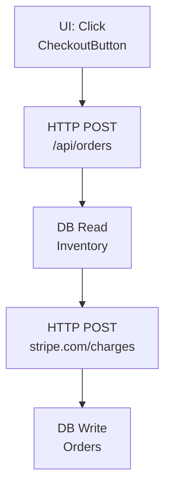

# Local Testing Guide: UI Workflow Scanner

## Quick Start (60 Seconds)

```bash
# 1. Navigate to scanner directory
cd /home/user/workflow-tracker/scanner

# 2. Install dependencies (if not already installed)
pip install -r requirements.txt

# 3. Run the Streamlit GUI
streamlit run cli/streamlit_app.py

# 4. Open browser to http://localhost:8501
```

**That's it!** The GUI will launch with a visual interface for testing.

---

## What's New: UI Workflow Detection

The scanner now detects **complete user workflows** from UI interaction to backend:

### What It Detects

**Frontend (React/TypeScript):**
- ✅ UI Event Handlers: `onClick`, `onSubmit`, `onChange`
- ✅ HTTP Calls: `fetch()`, `axios`, `http.get/post/put/delete`
- ✅ Component Names
- ✅ URL/Route associations
- ✅ **Workflow Chains**: UI Click → API Call

**Backend (C#/TypeScript):**
- ✅ Database Operations (READ/WRITE)
- ✅ API Endpoints
- ✅ File I/O
- ✅ Message Queues

**NEW: Workflow Chains**
- 🎯 UI Trigger → HTTP Call → Database Operation
- 🎯 Complete end-to-end user journeys
- 🎯 Grouped by URL/view

---

## Step-by-Step Testing Instructions

### Step 1: Launch the GUI

```bash
cd /home/user/workflow-tracker/scanner
streamlit run cli/streamlit_app.py
```

You should see:
```
🪅 Pinata Code
It's what's inside that counts
Analyze and visualize data workflows in your codebase
```

---

### Step 2: Configure Your Scan

In the left panel ("Repository Scanner"):

**Repository Path:**
- Enter the path to a repository you want to test
- Example: `/path/to/your/react-app`
- Or use a sample repo (see below for recommendations)

**File Extensions:**
- Default: `.cs,.ts,.js` (C#, TypeScript, JavaScript)
- For React apps, add: `.tsx,.jsx`
- Example: `.cs,.ts,.tsx,.jsx,.js`

**Detection Options:**
- ✅ Database Operations (detects DB queries)
- ✅ API Calls (detects HTTP requests)
- ✅ File I/O
- ✅ Message Queues
- ✅ Data Transforms (includes UI events now!)

**Click: "🔍 Start Scan"**

---

### Step 3: Watch the Scan Progress

You'll see:
- **Rainbow progress bar** with a pinata (🪅) moving across
- **Real-time file count** updating
- **Node count** increasing as operations are detected
- **ETA** showing estimated time remaining

**Example output:**
```
[12.5%] 125/1,000 files | Nodes: 342 | ETA: 2m 15s
```

**Scan speed:**
- Small repos (<100 files): ~5-10 seconds
- Medium repos (100-1000 files): ~30-60 seconds
- Large repos (1000-10000 files): ~2-5 minutes

---

### Step 4: Explore the Results

After scanning, you'll see **4 tabs**:

#### Tab 1: 📂 Scan Repository
**Summary metrics:**
- Files Scanned
- Workflow Nodes (total operations detected)
- Connections (edges between operations)
- Scan Time

---

#### Tab 2: 📊 Visualizations ✨ **TEST UI WORKFLOWS HERE**

**How to visualize UI workflows:**

1. **Filter By:** Select "Module/Directory"
2. **Select Filter:** Choose a frontend directory or component
   - Example: `src/components/CheckoutPage`
   - Example: `src/pages`
3. **Max Nodes:** 50 (adjust for complexity)
4. **Click:** "🎨 Generate Diagram"

**What to look for:**

**UI Trigger Nodes** (Yellow/Transform color):
```
[UI: Click]
User interaction in CheckoutButton
```

**HTTP Call Nodes** (Blue):
```
[HTTP POST]
Frontend API call to /api/orders
```

**Connected Workflow:**
```
[UI: Click] → [HTTP POST /api/orders]
```

**Example Diagram:**


**Download options:**
- 📥 Download Mermaid Code (`.mmd`)
- 📥 Download as Markdown (`.md`)

---

#### Tab 3: 🗄️ Database Schema

**What you'll see:**
- All database tables detected
- Read vs Write operation counts
- Sample queries from source code
- Table relationships (ER diagram)

**Search functionality:**
- 🔍 Search for specific tables
- ✅ Include related tables

**For each table:**
- Operations breakdown (colored circles)
- Model file path
- Table structure (JSON)
- Related tables
- Sample code snippets with locations

---

#### Tab 4: 📈 Data Analysis

**Activity Hot Spots:**
- Files with the most operations
- Identify busy code areas

**Common Workflow Patterns:**
- API → Database (data ingestion)
- Database → API (data retrieval)
- Database → Transform → API (processing)

**Most Connected Operations:**
- Integration points in your system

---

## Sample Repositories to Test

### Option 1: Test with Your Own Repo

**Good candidates:**
- React apps with API calls
- Next.js applications
- TypeScript codebases
- Full-stack applications (frontend + backend)

**What to scan:**
```bash
Repository Path: /path/to/your/app
File Extensions: .cs,.ts,.tsx,.jsx,.js
```

---

### Option 2: Create a Test Repository

Create a simple test app to see UI workflows:

```bash
# Create test directory
mkdir ~/test-workflow-scanner
cd ~/test-workflow-scanner
```

**Create `CheckoutPage.tsx`:**
```typescript
import React from 'react';

export function CheckoutPage() {
  const handleCheckout = async () => {
    // Validate form
    if (!validatePayment()) return;

    // Call API
    const response = await fetch('/api/orders', {
      method: 'POST',
      body: JSON.stringify({ items, payment })
    });

    const order = await response.json();
    showSuccessMessage(order);
  };

  return (
    <button onClick={handleCheckout}>
      Complete Checkout
    </button>
  );
}

function validatePayment() {
  return true;
}

function showSuccessMessage(order: any) {
  console.log('Order created:', order.id);
}
```

**Create `OrderController.cs`** (backend):
```csharp
using Microsoft.AspNetCore.Mvc;

[ApiController]
[Route("api/orders")]
public class OrderController : ControllerBase
{
    private readonly DbContext _context;

    [HttpPost]
    public async Task<IActionResult> CreateOrder([FromBody] OrderDto order)
    {
        // Check inventory
        var product = await _context.Inventory
            .Where(p => p.Id == order.ProductId)
            .FirstOrDefaultAsync();

        // Create order
        var newOrder = new Order {
            UserId = order.UserId,
            Total = order.Total
        };

        _context.Orders.Add(newOrder);
        await _context.SaveChangesAsync();

        return Ok(new { orderId = newOrder.Id });
    }
}
```

**Scan this test repo:**
```bash
Repository Path: ~/test-workflow-scanner
File Extensions: .tsx,.cs
```

**Expected Results:**
- **UI Trigger:** "UI: Click" in CheckoutPage.tsx
- **HTTP Call:** "HTTP POST /api/orders"
- **Backend Route:** Matched to OrderController.CreateOrder
- **Database Ops:** Inventory READ, Orders WRITE
- **Complete Workflow:** UI Click → API → DB

---

### Option 3: Clone a Sample Project

**React + Express Example:**
```bash
git clone https://github.com/someuser/sample-fullstack-app
cd sample-fullstack-app
```

Point the scanner at the repo root.

---

## Interpreting the Diagrams

### Understanding Node Colors

**From renderer.py:**
- 🟢 **Green** = Database READ
- 🟠 **Orange** = Database WRITE
- 🔵 **Blue** = API Call
- 🟣 **Purple** = File READ
- 🔴 **Pink** = File WRITE
- 🔷 **Cyan** = Message SEND
- 🟩 **Teal** = Message RECEIVE
- 🟡 **Yellow** = Data Transform / **UI Events**

### Understanding Edges (Arrows)

**Edge Labels:**
- `"User Action → API Call"` = UI workflow detected!
- `"Sequential (5 lines)"` = Operations close together in code
- `"Data Ingestion"` = API call → Database write
- `"Data Processing"` = Database read → Transform

### What a Good UI Workflow Looks Like

```
✅ Complete UI Workflow:

[UI: Click] → [HTTP POST /api/orders] → [DB Read: Inventory] → [DB Write: Orders]

This shows:
1. User clicks button (UI trigger)
2. Frontend makes API call
3. Backend reads from database
4. Backend writes to database
```

### Red Flags to Look For

```
⚠️ Disconnected nodes:
- UI triggers with no HTTP calls (dead code?)
- HTTP calls with no backend match (broken endpoints?)
- Database operations with no context (orphaned queries?)
```

---

## Troubleshooting

### Issue: "No nodes found matching 'MyComponent'"

**Solution:**
- The component might not have UI event handlers
- Try selecting a different filter (parent directory, URL)
- Check that file extensions include `.tsx` or `.jsx`

---

### Issue: "Scan is too slow"

**Solutions:**
1. **Reduce scope:**
   - Scan specific directories instead of entire repo
   - Repository Path: `/path/to/app/src/components`

2. **Exclude large directories:**
   - The scanner already excludes: `node_modules`, `bin`, `obj`, `.git`, `dist`, `build`
   - These are in the config automatically

3. **Adjust file extensions:**
   - Only scan what you need (`.tsx,.cs` instead of `.tsx,.ts,.js,.jsx,.cs`)

---

### Issue: "No UI triggers detected"

**Checklist:**
- ✅ File extensions include `.tsx` or `.jsx`
- ✅ Component has event handlers (`onClick`, `onSubmit`, etc.)
- ✅ Detection option "Data Transforms" is enabled (UI events are categorized here)

**Verify your code has patterns like:**
```typescript
<button onClick={handleClick}>     ✅ Will detect
<button onClick={handleSubmit}>    ✅ Will detect
<form onSubmit={handleSubmit}>     ✅ Will detect
```

---

### Issue: "HTTP calls not connected to UI triggers"

**This is expected if:**
- HTTP call is >50 lines away from UI trigger
- HTTP call is in a different file
- HTTP call is in a utility function

**To verify detection:**
- Check that both nodes exist separately
- UI trigger should be in the graph
- HTTP call should be in the graph
- Edge creation has a 50-line proximity limit

**Future enhancement:** Cross-file function call tracing will improve this.

---

## Advanced: Output Files

The scanner also saves files to `./output/`:

```bash
output/
├── workflow_graph.json       # All node/edge data (machine-readable)
├── workflow_graph.html       # Interactive Plotly visualization
└── workflow_documentation.md # Markdown documentation
```

**View JSON for debugging:**
```bash
cat output/workflow_graph.json | python -m json.tool | head -100
```

**Structure:**
```json
{
  "nodes": [
    {
      "id": "CheckoutPage.tsx:ui_trigger:15",
      "type": "data_transform",
      "name": "UI: Click",
      "metadata": {
        "is_ui_trigger": true,
        "component": "CheckoutPage",
        "handler": "handleCheckout",
        "url": "/checkout"
      }
    }
  ],
  "edges": [
    {
      "source": "CheckoutPage.tsx:ui_trigger:15",
      "target": "CheckoutPage.tsx:http:20",
      "label": "User Action → API Call"
    }
  ]
}
```

---

## What to Look For in Testing

### ✅ Success Criteria

**Basic functionality:**
- [ ] Scanner detects UI event handlers (`onClick`, `onSubmit`)
- [ ] Scanner detects HTTP calls (`fetch`, `axios`)
- [ ] Nodes appear in visualization
- [ ] Nodes have correct colors

**Workflow chains:**
- [ ] Edges connect UI triggers to HTTP calls
- [ ] Edge label says "User Action → API Call"
- [ ] Metadata includes `workflow_type: 'ui_to_api'`

**Filtering:**
- [ ] Can filter by component directory
- [ ] Can filter by URL/route
- [ ] Diagram updates when clicking "Generate Diagram"

**Performance:**
- [ ] Small repos (<100 files) scan in <10 seconds
- [ ] Large repos show progress updates
- [ ] No crashes or hangs

### 🎯 Test Cases

**Test Case 1: Simple UI Click**
```typescript
<button onClick={handleClick}>Click Me</button>

const handleClick = () => {
  fetch('/api/data');
};
```
**Expected:** 2 nodes (UI Click, HTTP GET), 1 edge

---

**Test Case 2: Form Submission**
```typescript
<form onSubmit={handleSubmit}>
  <button type="submit">Submit</button>
</form>

const handleSubmit = async (e) => {
  e.preventDefault();
  await axios.post('/api/submit', formData);
};
```
**Expected:** 2 nodes (UI Submit, HTTP POST), 1 edge

---

**Test Case 3: Multiple HTTP Calls**
```typescript
<button onClick={handleLoad}>Load</button>

const handleLoad = async () => {
  const users = await fetch('/api/users');
  const posts = await fetch('/api/posts');
};
```
**Expected:** 3 nodes (1 UI Click, 2 HTTP GETs), 2 edges

---

**Test Case 4: Distant HTTP Call (>50 lines)**
```typescript
<button onClick={handleClick}>Click</button>

const handleClick = () => {
  doSomething();
};

// ... 100 lines of code ...

function doSomething() {
  fetch('/api/data');  // Too far away
}
```
**Expected:** 2 nodes (UI Click, HTTP GET), 0 edges ❌
**Note:** This is a known limitation - cross-file tracing coming soon

---

## Next Steps After Testing

### If Everything Works ✅

Great! You've successfully tested UI workflow detection.

**Next features to add:**
1. **Backend route matching** - Connect frontend HTTP calls to backend routes
2. **Cross-file function tracing** - Follow function calls across files
3. **Simplified vs Deep views** - Business-friendly vs technical diagrams
4. **URL grouping** - Group workflows by page/route

### If You Find Issues 🐛

**Please note:**
- File path where issue occurred
- Expected behavior vs actual behavior
- Screenshot of the diagram (if applicable)
- Contents of `output/workflow_graph.json` (relevant section)

---

## Tips & Tricks

### Tip 1: Start Small
Test with a single component first:
```bash
Repository Path: /path/to/app/src/components/MyComponent
File Extensions: .tsx
```

### Tip 2: Use Dark Mode
Toggle dark mode in the sidebar for easier viewing.

### Tip 3: Filter Progressively
1. First scan: Entire repo → see overview
2. Second scan: Specific directory → see details
3. Third scan: Single component → see exact workflow

### Tip 4: Download Diagrams
Use "Download Mermaid Code" to save diagrams and include them in documentation.

### Tip 5: Check JSON for Debugging
If diagram looks wrong, check `output/workflow_graph.json`:
- Are the nodes you expect present?
- Do they have the right metadata?
- Are edges being created?

---

## Summary: Your Testing Checklist

**Before testing:**
- [ ] Install dependencies: `pip install -r requirements.txt`
- [ ] Have a test repository ready (or create one)

**During testing:**
- [ ] Launch GUI: `streamlit run cli/streamlit_app.py`
- [ ] Configure scan (path, extensions, detection options)
- [ ] Run scan and watch progress
- [ ] Explore all 4 tabs (Scan, Visualizations, Schema, Analysis)
- [ ] Generate filtered diagrams in Visualizations tab
- [ ] Try different filters (module, table, endpoint)

**Validate results:**
- [ ] UI triggers detected (yellow nodes, "UI: Click")
- [ ] HTTP calls detected (blue nodes, "HTTP POST")
- [ ] Edges created (arrows connecting UI → HTTP)
- [ ] Edge labels show "User Action → API Call"
- [ ] Database operations detected (if backend scanned)

**Performance:**
- [ ] Scan completes without errors
- [ ] Progress bar updates smoothly
- [ ] Diagrams render correctly
- [ ] No crashes or hangs

---

**Happy Testing! 🪅**

If you discover awesome workflows in your codebase, share them! The UI workflow feature is brand new and we'd love to see what you find.
