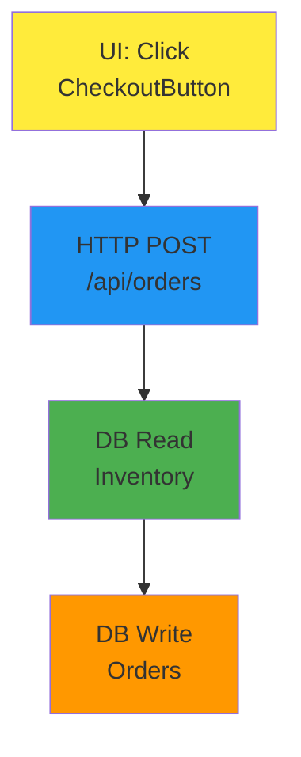

# UI Workflow Implementation Summary

## ✅ Implementation Complete!

Your scanner now detects **complete UI workflows** from button clicks to database operations.

---

## 🎯 What Was Implemented

### 1. React/TypeScript UI Scanner (`scanner/scanner/react_scanner.py`)

**Detects:**
- ✅ **UI Event Handlers**: `onClick`, `onSubmit`, `onChange`, `onLoad`
- ✅ **HTTP Calls**: `fetch()`, `axios.get/post()`, `http.get/post()`
- ✅ **Component Names**: Extracted from file
- ✅ **URL/Routes**: Associated with components
- ✅ **Workflow Chains**: UI Trigger → HTTP Call (within 50 lines)

**Example Detection:**
```typescript
// This code:
<button onClick={handleCheckout}>Checkout</button>

const handleCheckout = async () => {
    const response = await fetch('/api/orders', {
        method: 'POST',
        body: JSON.stringify(orderData)
    });
};

// Will create:
// Node 1: [UI: Click] in CheckoutButton component
// Node 2: [HTTP POST] /api/orders
// Edge: "User Action → API Call"
```

---

### 2. Integration with Existing Scanner

**Updated Files:**
- `scanner/scanner/__init__.py` - Exports ReactScanner
- `scanner/graph/builder.py` - Initializes and uses ReactScanner

**Now scans:** `.tsx`, `.jsx`, `.ts`, `.js` files for UI workflows

---

### 3. Testing Documentation

**Two comprehensive guides created:**

#### A. `TESTING_GUIDE.md` (Full Guide)
- Step-by-step GUI testing instructions
- Sample test cases
- Troubleshooting section
- Advanced features
- Output file documentation

#### B. `QUICK_TEST.md` (Quick Reference)
- 3-command quick start
- Visual node color guide
- Common test cases at a glance

---

## 🚀 How to Test Right Now

### Quick Start (3 Commands)

```bash
# 1. Navigate to scanner directory
cd /home/user/workflow-tracker/scanner

# 2. Install dependencies (if needed)
pip install -r requirements.txt

# 3. Launch GUI
streamlit run cli/streamlit_app.py
```

**Your browser will open to:** http://localhost:8501

---

### Using the GUI

#### Step 1: Configure Scan

In the **Repository Scanner** section:

**Repository Path:**
```
/path/to/your/react-app
```
or
```
/home/user/workflow-tracker  # Scan this repo itself
```

**File Extensions:**
```
.cs,.ts,.tsx,.jsx,.js
```
*Important: Include `.tsx` and `.jsx` for React components*

**Detection Options:**
- ✅ Check ALL boxes (especially "Data Transforms" which includes UI events)

**Click:** 🔍 Start Scan

---

#### Step 2: Watch Progress

You'll see:
- 🪅 **Pinata moving across rainbow progress bar**
- **Real-time file count** updating
- **Node count** growing
- **ETA** for completion

**Typical scan times:**
- Small repo (<100 files): 5-10 seconds
- Medium repo (100-1000 files): 30-60 seconds
- Large repo (1000-10000 files): 2-5 minutes

---

#### Step 3: View Results

After scan completes, you'll see **4 tabs**:

##### Tab 1: 📂 Scan Repository
Summary metrics

##### Tab 2: 📊 Visualizations ⭐ **TEST UI WORKFLOWS HERE**

**How to see UI workflows:**

1. **Filter By:** Select `Module/Directory`
2. **Select Filter:** Choose a frontend directory
   - Example: `src/components`
   - Example: `app/pages`
3. **Max Nodes:** `50` (adjust as needed)
4. **Click:** 🎨 Generate Diagram

**What you'll see in the diagram:**



**Node Colors:**
- 🟡 **Yellow** = UI Events (your new feature!)
- 🔵 **Blue** = API Calls
- 🟢 **Green** = Database READ
- 🟠 **Orange** = Database WRITE

##### Tab 3: 🗄️ Database Schema
View all database tables and operations

##### Tab 4: 📈 Data Analysis
Hot spots and workflow patterns

---

## 📝 Example Test Case

### Create a Simple Test File

**File: `test_component.tsx`**
```typescript
import React from 'react';

export function TestComponent() {
  const handleSubmit = async (e: React.FormEvent) => {
    e.preventDefault();

    // This will be detected as HTTP call
    const response = await fetch('/api/test', {
      method: 'POST',
      body: JSON.stringify({ data: 'test' })
    });

    console.log(await response.json());
  };

  return (
    // This will be detected as UI trigger
    <form onSubmit={handleSubmit}>
      <button type="submit">Submit</button>
    </form>
  );
}
```

**Scan this file with the GUI:**

**Expected Results:**
- ✅ **Node 1**: `UI: Submit` (yellow) - form submission trigger
- ✅ **Node 2**: `HTTP POST /api/test` (blue) - API call
- ✅ **Edge**: "User Action → API Call" connecting the two

**To verify:**
1. Scan the directory containing this file
2. Go to Visualizations tab
3. Filter by the component's directory
4. Generate diagram
5. You should see both nodes connected!

---

## 🎨 Diagram Features

### Interactive Features

**Download Options:**
- 📥 **Download Mermaid Code** - Get `.mmd` file for documentation
- 📥 **Download as Markdown** - Get `.md` file with embedded diagram

**Hover over nodes:**
- See full details (location, type, description)
- View code snippets
- See metadata

**Zoom and Pan:**
- Interactive diagram can be zoomed
- Click and drag to pan

---

### What Each Node Shows

**UI Trigger Node (Yellow):**
```
[UI: Click]
User interaction in CheckoutPage
```
**Metadata includes:**
- Component name
- Event handler function
- URL/route
- Trigger type (click, submit, change)

**HTTP Call Node (Blue):**
```
[HTTP POST]
Frontend API call to /api/orders
```
**Metadata includes:**
- HTTP method (GET, POST, PUT, DELETE)
- Endpoint URL
- Library used (fetch, axios, http)

---

## 🔍 Advanced Features

### Output Files

All scans save to `./output/` directory:

```bash
output/
├── workflow_graph.json       # Machine-readable data
├── workflow_graph.html       # Interactive visualization
└── workflow_documentation.md # Human-readable docs
```

**View JSON:**
```bash
cat output/workflow_graph.json | python -m json.tool | less
```

**Example JSON structure:**
```json
{
  "nodes": [
    {
      "id": "CheckoutPage.tsx:ui_trigger:15",
      "type": "data_transform",
      "name": "UI: Click",
      "location": {
        "file": "src/components/CheckoutPage.tsx",
        "line": 15
      },
      "metadata": {
        "is_ui_trigger": true,
        "trigger_type": "ui_click",
        "component": "CheckoutPage",
        "handler": "handleCheckout",
        "url": "/checkout"
      }
    },
    {
      "id": "CheckoutPage.tsx:http:20",
      "type": "api_call",
      "name": "HTTP POST",
      "endpoint": "/api/orders",
      "method": "POST",
      "metadata": {
        "is_frontend_call": true,
        "library": "fetch"
      }
    }
  ],
  "edges": [
    {
      "source": "CheckoutPage.tsx:ui_trigger:15",
      "target": "CheckoutPage.tsx:http:20",
      "label": "User Action → API Call",
      "metadata": {
        "workflow_type": "ui_to_api"
      }
    }
  ]
}
```

---

## 🐛 Troubleshooting

### No UI Triggers Detected?

**Checklist:**
- [ ] File extensions include `.tsx` or `.jsx`
- [ ] Component has event handlers (`onClick`, `onSubmit`, etc.)
- [ ] "Data Transforms" detection is enabled in scan config
- [ ] Files actually contain React/JSX code

**Verify with this test:**
```typescript
// Minimal test - should ALWAYS detect this
export function Test() {
  return <button onClick={() => console.log('test')}>Click</button>;
}
```

---

### HTTP Calls Not Connected?

**This is expected when:**
- HTTP call is >50 lines away from UI trigger
- HTTP call is in a different file/function
- HTTP call is async and deeply nested

**Current proximity limit:** 50 lines

**Future enhancement:** Cross-file function call tracing will fix this

---

### Diagrams Not Showing?

**Try:**
1. Click "Generate Diagram" button
2. Select different filter option
3. Increase "Max Nodes" to 100
4. Check browser console for errors
5. Try filtering by a directory you KNOW has code

---

## 📊 What Workflows Look Like

### Simple UI Workflow
```
User clicks button → API call made
```
**Diagram:**
```
[UI: Click] → [HTTP GET /api/data]
```

### Form Submission Workflow
```
User submits form → POST request → Database write
```
**Diagram:**
```
[UI: Submit] → [HTTP POST /api/submit] → [DB Write: Users]
```

### Complex Multi-Step Workflow
```
User clicks checkout → Multiple API calls → Database operations
```
**Diagram:**
```
[UI: Click]
    ↓
[HTTP POST /api/orders]
    ↓
[DB Read: Inventory]
    ↓
[HTTP POST stripe.com/charges]
    ↓
[DB Write: Orders]
    ↓
[HTTP POST sendgrid.com/mail]
```

---

## 🎯 Success Criteria

### ✅ You'll Know It's Working When:

**Basic Detection:**
- [ ] Yellow nodes labeled "UI: Click" or "UI: Submit" appear
- [ ] Blue nodes labeled "HTTP GET/POST/PUT/DELETE" appear
- [ ] Nodes show correct file locations

**Workflow Chains:**
- [ ] Arrows connect UI triggers to HTTP calls
- [ ] Arrow labels say "User Action → API Call"
- [ ] Edge metadata shows `workflow_type: 'ui_to_api'`

**Visualization:**
- [ ] Diagrams render without errors
- [ ] Filtering works (by module, table, endpoint)
- [ ] Download buttons work
- [ ] Hover shows node details

**Performance:**
- [ ] Small repos scan in <10 seconds
- [ ] Progress bar updates smoothly
- [ ] No crashes or hangs
- [ ] Multiple scans work (can re-scan)

---

## 🚧 Known Limitations (Will Fix Next)

### 1. Cross-File Function Tracing
**Current:** Only detects workflows within same file
**Future:** Will trace function calls across files

**Example not detected yet:**
```typescript
// File 1: Button.tsx
<button onClick={handleClick}>Click</button>

// File 2: api.ts
export function handleClick() {
    fetch('/api/data');  // Won't connect yet
}
```

---

### 2. Backend Route Matching
**Current:** Detects frontend HTTP calls
**Future:** Will match to backend route handlers

**Example:**
```typescript
// Frontend
fetch('/api/orders', { method: 'POST' })

// Backend (not matched yet)
[HttpPost("/api/orders")]
public async Task<IActionResult> CreateOrder() { ... }
```

---

### 3. Simplified vs Deep Views
**Current:** One technical view
**Future:** Two modes
- **Simplified** (for Product/Support teams): Business language
- **Deep** (for Developers): Technical details with code

---

### 4. URL Grouping Dashboard
**Current:** Filter by directory
**Future:** Group all workflows by URL

**Example:**
```
📄 /checkout page
  - Workflow 1: Add to Cart
  - Workflow 2: Update Quantity
  - Workflow 3: Complete Checkout ⚠️ High Risk
  - Workflow 4: Apply Coupon
```

---

## 📚 Documentation Reference

**For detailed testing:** Read `TESTING_GUIDE.md`
**For quick start:** Read `QUICK_TEST.md`
**For UI workflow design:** Read `USER_WORKFLOW_VISUALIZATION.md`

---

## 🎉 What You Can Do Now

### Immediate Value

1. **Understand Legacy Code**
   - See how UI interactions trigger backend operations
   - Identify all user workflows in your app

2. **Onboard New Developers**
   - Show complete user journeys visually
   - No need to dig through code for hours

3. **Document Workflows**
   - Export diagrams to Markdown
   - Include in PRs and documentation

4. **Find Dead Code**
   - UI triggers with no HTTP calls = unused features?
   - HTTP calls with no backend match = broken endpoints?

5. **Performance Analysis**
   - See how many API calls happen per user action
   - Identify chatty UIs (too many HTTP requests)

---

## 🔮 Coming Next

**Priority 1: Backend Matching**
- Connect frontend HTTP calls to backend route handlers
- Show complete end-to-end flow: UI → API → DB → Response

**Priority 2: Cross-File Tracing**
- Follow function calls across files
- Build complete call stacks

**Priority 3: Dual-Mode Visualization**
- Simplified view for non-technical teams
- Deep view for developers

**Priority 4: URL Grouping**
- Group workflows by page/route
- See all interactions on a single view

---

## ✨ Quick Start Commands (Summary)

```bash
# 1. Launch GUI
cd /home/user/workflow-tracker/scanner
streamlit run cli/streamlit_app.py

# 2. In GUI:
#    - Repository Path: /path/to/your/app
#    - File Extensions: .cs,.ts,.tsx,.jsx,.js
#    - Enable all detection options
#    - Click: Start Scan

# 3. After scan:
#    - Go to Visualizations tab
#    - Filter By: Module/Directory
#    - Select: src/components
#    - Click: Generate Diagram

# 4. Look for:
#    - Yellow nodes (UI triggers)
#    - Blue nodes (HTTP calls)
#    - Arrows (workflow connections)
```

---

## 🆘 Need Help?

**Check these files:**
1. `TESTING_GUIDE.md` - Comprehensive testing documentation
2. `QUICK_TEST.md` - Quick reference card
3. `output/workflow_graph.json` - Raw scan data for debugging

**Common issues:**
- No nodes? Check file extensions include `.tsx` or `.jsx`
- No edges? Nodes might be >50 lines apart
- Diagram empty? Try different filter or increase max nodes

---

**🎊 Congratulations! Your UI workflow scanner is ready to test!**

Start with a small React component and see the magic happen. The scanner will visualize complete user journeys from button clicks to database operations.

Happy testing! 🪅
