# User Workflow Visualization Design
## UI-Triggered End-to-End Journey Mapping

**Feature Request**: Track complete user workflows from UI interaction → backend processing → response
**Target Audiences**:
- **Cross-functional teams** (Product, Support, QA) - Simplified view
- **Software development teams** - Deep technical view

**Date**: November 3, 2025

---

## Table of Contents
1. [Executive Summary](#executive-summary)
2. [Use Cases](#use-cases)
3. [Architecture Design](#architecture-design)
4. [Data Models](#data-models)
5. [Detection Strategies](#detection-strategies)
6. [Visualization Examples](#visualization-examples)
7. [Implementation Plan](#implementation-plan)
8. [API Design](#api-design)

---

## Executive Summary

### What This Adds

**Current Capability**: Detect data operations (DB queries, API calls, file I/O)
**New Capability**: Map complete user journeys from UI interaction to system response

**Example User Workflow**:
```
User clicks "Checkout" button
  → Frontend validates form
  → POST /api/orders
    → Backend validates order
    → Queries Inventory database (READ)
    → Calls Stripe API (charge payment)
    → Updates Orders database (WRITE)
    → Sends email via SendGrid API
    → Returns order confirmation
  → Frontend displays success message
```

### Two Visualization Modes

#### **1. Simplified Mode** (for non-technical teams)
```
[User Action: Click "Checkout"]
    ↓
[Validate Payment Info]
    ↓
[Process Payment with Stripe]
    ↓
[Create Order]
    ↓
[Send Confirmation Email]
    ↓
[Show Success Message]
```

**Purpose**:
- Customer support understands what happens when user clicks button
- Product managers see complete user journey
- QA teams understand test scenarios
- Business stakeholders visualize processes

---

#### **2. Deep Technical Mode** (for developers)
```
[UI: CheckoutButton.tsx:45 - onClick handler]
    ↓
[Frontend: validateCheckoutForm() - CheckoutPage.tsx:120]
    ↓ (form data)
[HTTP POST] /api/orders
    ↓
[API: OrderController.CreateOrder() - OrderController.cs:67]
    ↓
[DB READ] Inventory table - InventoryService.cs:45
    ├─ Query: SELECT * FROM Inventory WHERE ProductId = @id
    ↓
[Third-Party API] Stripe.Charges.Create() - PaymentService.cs:89
    ├─ Endpoint: https://api.stripe.com/v1/charges
    ├─ Method: POST
    ↓
[DB WRITE] Orders table - OrderService.cs:123
    ├─ Query: INSERT INTO Orders (UserId, Total, Status)
    ↓
[Third-Party API] SendGrid.SendEmail() - EmailService.cs:56
    ├─ Endpoint: https://api.sendgrid.com/v3/mail/send
    ↓
[HTTP Response] 201 Created - OrderController.cs:78
    ├─ Body: { orderId: 12345, status: "confirmed" }
    ↓
[Frontend: onSuccess callback - CheckoutPage.tsx:145]
    ↓
[UI: Display SuccessModal - SuccessModal.tsx:23]
```

**Purpose**:
- Developers understand complete technical flow
- Code review identifies missing error handling
- Performance analysis finds bottlenecks
- Documentation for new team members

---

## Use Cases

### Use Case 1: Customer Support Troubleshooting

**Scenario**: Support team gets ticket: "Checkout failed but I was charged"

**Without This Feature**:
- Support asks developers "What happens during checkout?"
- Developers dig through code
- Hours wasted on basic questions

**With This Feature** (Simplified View):
```
Support looks at "Checkout Workflow" diagram:
1. Validate Payment Info ✅
2. Process Payment with Stripe ✅ (user was charged here)
3. Create Order ❌ (this must have failed)
4. Send Confirmation Email ❌ (didn't run)
5. Show Success Message ❌ (didn't run)

Support immediately knows: "Payment succeeded but order creation failed"
→ Routes to correct team with correct info
```

**Value**: Support resolves issues faster without developer help

---

### Use Case 2: Onboarding New Developers

**Scenario**: New developer joins team, needs to understand "How does login work?"

**Without This Feature**:
- Read scattered documentation
- Ask senior devs repeatedly
- Days to understand flow

**With This Feature** (Deep Technical View):
```
New dev views "Login Workflow" diagram:
1. UI trigger: LoginButton.tsx:34
2. Form validation: validateLogin()
3. API call: POST /api/auth/login
4. Backend: AuthController.Login() - AuthController.cs:45
5. DB query: Users table (read)
6. Password hash check: BCrypt.Verify()
7. JWT token generation: JwtService.GenerateToken()
8. Session storage: Redis SET user:session:123
9. Response: { token, user }
10. Frontend: Store token in localStorage
11. Redirect to /dashboard

Complete understanding in 5 minutes instead of 5 hours
```

**Value**: Faster onboarding, self-service documentation

---

### Use Case 3: Performance Optimization

**Scenario**: "Checkout page is slow" - where's the bottleneck?

**With Deep Technical View**:
```
[UI Click] 0ms
    ↓
[Form Validation] +50ms
    ↓
[POST /api/orders] +200ms (network)
    ↓
[Backend Processing]
    ├─ [DB READ Inventory] +1,500ms ⚠️ SLOW! (N+1 query detected)
    ├─ [Stripe API] +800ms
    ├─ [DB WRITE Orders] +100ms
    ├─ [SendGrid API] +300ms
    ↓
[Response] +200ms (network)
    ↓
[UI Update] +50ms

Total: 3,200ms (3.2 seconds)
Bottleneck identified: Inventory query (1.5s)
```

**Value**: Pinpoint exact performance bottleneck

---

### Use Case 4: Security Audit

**Scenario**: "Show me all workflows that access user payment data"

**With URL Grouping**:
```
Workflows accessing PaymentMethods table:
1. /checkout → ProcessOrder workflow
2. /settings/payment → UpdatePaymentMethod workflow
3. /subscription/upgrade → UpgradeSubscription workflow

For each workflow, show:
- Authentication checks
- Authorization checks
- Encryption points
- Third-party API calls (PCI compliance)
```

**Value**: Security compliance and audit trails

---

## Architecture Design

### Core Concept: Workflow Chains

**Current System**: Detects isolated operations
```
[DB Query: Users]  [API Call: Stripe]  [DB Write: Orders]
(disconnected nodes)
```

**New System**: Chains operations into workflows
```
[UI Trigger] → [Validation] → [API Call] → [DB Query] → [Third-party API] → [Response]
(connected workflow)
```

### How to Build Workflow Chains

#### Strategy 1: Static Analysis (Code Tracing)

**Trace call stack from UI event handlers**:

```typescript
// Frontend: CheckoutPage.tsx
function handleCheckout() {  // ← START HERE (UI trigger)
    validateForm();          // ← Step 1
    submitOrder();           // ← Step 2
}

async function submitOrder() {
    const response = await fetch('/api/orders', {  // ← Step 3 (HTTP call)
        method: 'POST',
        body: JSON.stringify(orderData)
    });
}
```

**Trace backend from route handler**:
```csharp
// Backend: OrderController.cs
[HttpPost("/api/orders")]  // ← ENTRY POINT (matches frontend)
public async Task<IActionResult> CreateOrder([FromBody] OrderDto order)  // ← Step 4
{
    await _inventoryService.CheckStock(order.ProductId);  // ← Step 5 (DB read)
    await _paymentService.ChargeCard(order.Payment);      // ← Step 6 (Stripe API)
    await _orderService.SaveOrder(order);                 // ← Step 7 (DB write)
    await _emailService.SendConfirmation(order.Email);    // ← Step 8 (SendGrid API)
    return Ok(new { orderId = order.Id });                // ← Step 9 (response)
}
```

**Build Chain**:
1. Detect UI event handler (`handleCheckout`)
2. Follow function calls (`validateForm`, `submitOrder`)
3. Find HTTP requests (`fetch('/api/orders')`)
4. Match to backend route (`[HttpPost("/api/orders")]`)
5. Trace backend execution path
6. Connect all detected operations (DB, API, etc.)

---

#### Strategy 2: Convention-Based Detection

**Common Patterns to Detect**:

**Frontend Event Handlers**:
- React: `onClick`, `onSubmit`, `onChange`
- Vue: `@click`, `@submit`
- Angular: `(click)`, `(submit)`

**Frontend-to-Backend Connections**:
- HTTP calls: `fetch()`, `axios`, `$.ajax`, `http.post()`
- GraphQL: `useQuery`, `useMutation`
- WebSockets: `socket.emit()`

**Backend Route Handlers**:
- ASP.NET: `[HttpGet]`, `[HttpPost]`, `[Route]`
- Express: `app.get()`, `app.post()`
- FastAPI: `@app.get`, `@app.post`
- Spring: `@GetMapping`, `@PostMapping`

**Backend Operations** (already detected):
- Database queries (existing feature)
- API calls (existing feature)
- File operations (existing feature)

---

#### Strategy 3: Metadata Annotations (Future: User-Assisted)

Allow developers to annotate workflows:
```typescript
/**
 * @workflow Checkout
 * @ui-trigger CheckoutButton
 * @description Complete order purchase flow
 */
async function handleCheckout() {
    // ...
}
```

---

### Data Flow

```
┌─────────────────────────────────────────────────────────┐
│ STEP 1: Scan Frontend Code                             │
│ - Detect UI event handlers (onClick, onSubmit)          │
│ - Extract HTTP calls (fetch, axios)                     │
│ - Map component hierarchy                               │
└─────────────────────┬───────────────────────────────────┘
                      │
                      ▼
┌─────────────────────────────────────────────────────────┐
│ STEP 2: Scan Backend Code                              │
│ - Detect route handlers ([HttpPost], @app.get)          │
│ - Trace function call chains                            │
│ - Detect operations (DB, API, file I/O) [existing]      │
└─────────────────────┬───────────────────────────────────┘
                      │
                      ▼
┌─────────────────────────────────────────────────────────┐
│ STEP 3: Build Workflow Graph                            │
│ - Match frontend HTTP calls to backend routes           │
│ - Chain operations in execution order                   │
│ - Identify workflow start (UI) and end (response)       │
└─────────────────────┬───────────────────────────────────┘
                      │
                      ▼
┌─────────────────────────────────────────────────────────┐
│ STEP 4: Group Workflows                                 │
│ - By URL (/checkout, /login, /settings)                 │
│ - By feature (Authentication, Orders, Payments)         │
│ - By component (CheckoutPage, LoginForm)                │
└─────────────────────┬───────────────────────────────────┘
                      │
                      ▼
┌─────────────────────────────────────────────────────────┐
│ STEP 5: Generate Visualizations                         │
│ - Simplified view (business logic only)                 │
│ - Deep view (technical details)                         │
│ - Export to Mermaid, JSON, interactive HTML             │
└─────────────────────────────────────────────────────────┘
```

---

## Data Models

### Extended Models

```python
from enum import Enum
from dataclasses import dataclass, field
from typing import List, Optional

class WorkflowTriggerType(Enum):
    """How the workflow is initiated"""
    UI_CLICK = "ui_click"           # Button click
    UI_SUBMIT = "ui_submit"         # Form submission
    UI_CHANGE = "ui_change"         # Input change
    PAGE_LOAD = "page_load"         # Component mount
    ROUTE_CHANGE = "route_change"   # Navigation
    WEBSOCKET = "websocket"         # Real-time event
    SCHEDULED = "scheduled"         # Cron job, timer
    WEBHOOK = "webhook"             # External trigger

@dataclass
class UITrigger:
    """Represents a UI interaction that starts a workflow"""
    id: str
    trigger_type: WorkflowTriggerType
    component_name: str             # e.g., "CheckoutButton"
    component_file: str             # e.g., "CheckoutPage.tsx"
    location: CodeLocation          # Line number
    event_handler: str              # e.g., "handleCheckout"
    url: Optional[str]              # e.g., "/checkout"
    route: Optional[str]            # e.g., "/checkout/:id"
    description: str                # e.g., "User clicks Checkout button"
    metadata: Dict[str, any] = field(default_factory=dict)

@dataclass
class HTTPConnection:
    """Represents frontend-to-backend HTTP call"""
    id: str
    method: str                     # GET, POST, PUT, DELETE
    endpoint: str                   # e.g., "/api/orders"
    frontend_location: CodeLocation # Where call is made
    backend_route: Optional[str]    # Matched backend route handler
    backend_location: Optional[CodeLocation]
    request_body: Optional[str]     # Type or example
    response_type: Optional[str]    # Type or example
    metadata: Dict[str, any] = field(default_factory=dict)

@dataclass
class UserWorkflow:
    """Complete end-to-end user workflow"""
    id: str
    name: str                       # e.g., "Checkout Process"
    description: str
    trigger: UITrigger              # How workflow starts
    steps: List[WorkflowNode]       # Ordered list of operations
    http_connections: List[HTTPConnection]

    # Grouping
    url: Optional[str]              # e.g., "/checkout"
    feature: Optional[str]          # e.g., "Orders"
    component: Optional[str]        # e.g., "CheckoutPage"

    # Metadata
    estimated_duration_ms: Optional[int]
    complexity_score: int           # Based on # of steps
    risk_score: int                 # Based on operations (payments = high)

    # Analysis
    has_error_handling: bool
    has_authentication: bool
    has_authorization: bool
    third_party_apis: List[str]     # e.g., ["Stripe", "SendGrid"]
    database_tables: List[str]      # e.g., ["Orders", "Inventory"]

    metadata: Dict[str, any] = field(default_factory=dict)

@dataclass
class WorkflowVisualization:
    """Visualization settings for workflows"""
    workflow_id: str
    view_mode: str                  # "simplified" or "deep"
    format: str                     # "mermaid", "json", "html"
    group_by: str                   # "url", "feature", "component"

    # Simplified view settings
    show_technical_details: bool = False
    show_code_locations: bool = False
    show_queries: bool = False

    # Deep view settings
    show_timing: bool = True
    show_error_paths: bool = True
    show_dependencies: bool = True
```

---

### Extended WorkflowNode

Add fields to existing `WorkflowNode`:

```python
@dataclass
class WorkflowNode:
    # ... existing fields ...

    # NEW: Workflow chain metadata
    workflow_id: Optional[str]      # Which workflow this belongs to
    step_number: Optional[int]      # Order in workflow (1, 2, 3...)
    is_ui_trigger: bool = False     # Is this the starting UI action?
    is_response: bool = False       # Is this the final response?

    # NEW: Execution context
    execution_layer: str            # "frontend", "backend", "database", "third_party"
    estimated_duration_ms: Optional[int]

    # NEW: Business logic
    business_description: Optional[str]  # Simplified description for non-technical users
    # e.g., "Process payment with Stripe" vs "PaymentService.ChargeCard()"
```

---

## Detection Strategies

### Frontend Detection

#### React/TypeScript Scanner

```python
class ReactScanner(BaseScanner):
    """Scanner for React/Next.js applications"""

    # UI Event Handler Patterns
    EVENT_HANDLER_PATTERNS = [
        r'onClick\s*=\s*\{(\w+)\}',           # onClick={handleClick}
        r'onSubmit\s*=\s*\{(\w+)\}',          # onSubmit={handleSubmit}
        r'onChange\s*=\s*\{(\w+)\}',          # onChange={handleChange}
        r'const\s+(\w+)\s*=\s*\(\)\s*=>\s*\{', # const handleClick = () => {
        r'function\s+(\w+)\s*\([^)]*\)\s*\{',  # function handleClick() {
    ]

    # HTTP Call Patterns
    HTTP_CALL_PATTERNS = [
        r'fetch\s*\(\s*[\'"]([^\'"]+)[\'"]',   # fetch('/api/orders')
        r'axios\.(get|post|put|delete)\s*\(\s*[\'"]([^\'"]+)[\'"]',  # axios.post('/api/orders')
        r'http\.(get|post)\s*\(\s*[\'"]([^\'"]+)[\'"]',  # http.post('/api/orders')
    ]

    # Component Detection
    COMPONENT_PATTERNS = [
        r'export\s+(?:default\s+)?(?:function|const)\s+(\w+)',  # export function CheckoutPage
        r'const\s+(\w+)\s*=\s*\(\)\s*=>\s*\(',                  # const CheckoutPage = () => (
    ]

    def scan_file(self, file_path: str) -> List[UserWorkflow]:
        """Scan React file for UI workflows"""
        content = self.read_file(file_path)
        workflows = []

        # 1. Detect UI components
        components = self._detect_components(file_path, content)

        # 2. Detect event handlers
        event_handlers = self._detect_event_handlers(file_path, content)

        # 3. Detect HTTP calls
        http_calls = self._detect_http_calls(file_path, content)

        # 4. Build workflow chains
        for handler in event_handlers:
            workflow = self._build_workflow_from_handler(
                handler, http_calls, components
            )
            if workflow:
                workflows.append(workflow)

        return workflows

    def _detect_event_handlers(self, file_path: str, content: str) -> List[UITrigger]:
        """Find onClick, onSubmit, etc. handlers"""
        triggers = []
        lines = content.split('\n')

        for i, line in enumerate(lines, 1):
            # Find onClick={handleCheckout}
            match = re.search(r'onClick\s*=\s*\{(\w+)\}', line)
            if match:
                handler_name = match.group(1)

                # Extract URL/route from context (look for <Route path=...>)
                url = self._extract_url_from_context(lines, i)

                trigger = UITrigger(
                    id=f"{file_path}:ui_trigger:{i}",
                    trigger_type=WorkflowTriggerType.UI_CLICK,
                    component_name=self._get_component_name(file_path),
                    component_file=file_path,
                    location=CodeLocation(file_path, i),
                    event_handler=handler_name,
                    url=url,
                    description=f"User clicks button",
                    metadata={'line': line.strip()}
                )
                triggers.append(trigger)

        return triggers

    def _detect_http_calls(self, file_path: str, content: str) -> List[HTTPConnection]:
        """Find fetch(), axios calls"""
        http_calls = []
        lines = content.split('\n')

        for i, line in enumerate(lines, 1):
            # Find fetch('/api/orders', { method: 'POST' })
            fetch_match = re.search(r'fetch\s*\(\s*[\'"]([^\'"]+)[\'"]', line)
            if fetch_match:
                endpoint = fetch_match.group(1)
                method = self._extract_http_method(lines, i)  # Look for method: 'POST'

                http_call = HTTPConnection(
                    id=f"{file_path}:http:{i}",
                    method=method or "GET",
                    endpoint=endpoint,
                    frontend_location=CodeLocation(file_path, i),
                    backend_route=None,  # Will match later
                    backend_location=None,
                    metadata={'line': line.strip()}
                )
                http_calls.append(http_call)

        return http_calls

    def _build_workflow_from_handler(
        self,
        trigger: UITrigger,
        http_calls: List[HTTPConnection],
        components: List[str]
    ) -> Optional[UserWorkflow]:
        """
        Build workflow chain starting from UI trigger.
        Trace function calls to find HTTP requests made by this handler.
        """
        # Find HTTP calls made within this handler's scope
        # (This requires more sophisticated AST parsing for perfect accuracy)

        relevant_http_calls = [
            call for call in http_calls
            if self._is_in_handler_scope(trigger, call)
        ]

        if not relevant_http_calls:
            return None  # No backend interaction, just UI-only

        workflow = UserWorkflow(
            id=f"workflow:{trigger.id}",
            name=f"{trigger.component_name} - {trigger.event_handler}",
            description=f"User workflow triggered by {trigger.description}",
            trigger=trigger,
            steps=[],  # Will populate from backend scan
            http_connections=relevant_http_calls,
            url=trigger.url,
            component=trigger.component_name,
            complexity_score=0,
            risk_score=0,
            has_error_handling=False,
            has_authentication=False,
            has_authorization=False,
            third_party_apis=[],
            database_tables=[]
        )

        return workflow
```

---

### Backend Detection

#### C# ASP.NET Scanner Enhancement

```python
class CSharpWebScanner(CSharpScanner):
    """Extended C# scanner for web workflows"""

    # Route Handler Patterns
    ROUTE_PATTERNS = [
        r'\[HttpGet\s*\(\s*[\'"]([^\'"]+)[\'"]\s*\)\]',   # [HttpGet("/api/orders")]
        r'\[HttpPost\s*\(\s*[\'"]([^\'"]+)[\'"]\s*\)\]',  # [HttpPost("/api/orders")]
        r'\[Route\s*\(\s*[\'"]([^\'"]+)[\'"]\s*\)\]',     # [Route("/api/orders")]
    ]

    def scan_for_routes(self, file_path: str) -> List[HTTPConnection]:
        """Find route handlers and match to frontend"""
        content = self.read_file(file_path)
        routes = []
        lines = content.split('\n')

        for i, line in enumerate(lines, 1):
            # Find [HttpPost("/api/orders")]
            match = re.search(r'\[Http(Get|Post|Put|Delete)\s*\(\s*[\'"]([^\'"]+)[\'"]\s*\)\]', line)
            if match:
                method = match.group(1).upper()
                endpoint = match.group(2)

                # Next line should be the method signature
                if i < len(lines):
                    next_line = lines[i]
                    method_match = re.search(r'public\s+\w+\s+(\w+)\s*\(', next_line)
                    if method_match:
                        method_name = method_match.group(1)

                        route = HTTPConnection(
                            id=f"{file_path}:route:{i}",
                            method=method,
                            endpoint=endpoint,
                            frontend_location=None,  # Will match from frontend
                            backend_route=method_name,
                            backend_location=CodeLocation(file_path, i+1),
                            metadata={
                                'controller': self._get_controller_name(file_path),
                                'line': line.strip()
                            }
                        )
                        routes.append(route)

        return routes

    def trace_execution_path(
        self,
        route_handler: HTTPConnection,
        content: str
    ) -> List[WorkflowNode]:
        """
        Trace execution path from route handler.
        Follow method calls to build complete workflow.
        """
        steps = []

        # Start from route handler method
        start_line = route_handler.backend_location.line_number

        # Find method body
        method_body = self._extract_method_body(content, start_line)

        # Scan method body for operations (DB, API, etc.)
        operations = self._scan_operations_in_method(method_body, start_line)

        # Order operations by line number
        operations.sort(key=lambda op: op.location.line_number)

        # Number steps
        for step_num, operation in enumerate(operations, 1):
            operation.workflow_id = route_handler.id
            operation.step_number = step_num
            operation.execution_layer = self._determine_layer(operation)
            steps.append(operation)

        return steps

    def _determine_layer(self, operation: WorkflowNode) -> str:
        """Determine which layer this operation belongs to"""
        if operation.type in [WorkflowType.DATABASE_READ, WorkflowType.DATABASE_WRITE]:
            return "database"
        elif operation.type == WorkflowType.API_CALL:
            # Check if third-party or internal
            if operation.endpoint and any(domain in operation.endpoint for domain in ['stripe.com', 'sendgrid.com', 'twilio.com']):
                return "third_party"
            return "backend"
        elif operation.type in [WorkflowType.FILE_READ, WorkflowType.FILE_WRITE]:
            return "filesystem"
        else:
            return "backend"
```

---

### Workflow Matcher

```python
class WorkflowMatcher:
    """Matches frontend workflows to backend implementations"""

    def match_workflows(
        self,
        frontend_workflows: List[UserWorkflow],
        backend_routes: List[HTTPConnection],
        backend_operations: Dict[str, List[WorkflowNode]]  # route_id -> operations
    ) -> List[UserWorkflow]:
        """
        Connect frontend workflows to backend implementation.
        Returns complete end-to-end workflows.
        """
        complete_workflows = []

        for workflow in frontend_workflows:
            # Match each HTTP call to backend route
            for http_call in workflow.http_connections:
                matched_route = self._find_matching_route(
                    http_call, backend_routes
                )

                if matched_route:
                    # Add backend operations to workflow
                    operations = backend_operations.get(matched_route.id, [])
                    workflow.steps.extend(operations)

                    # Extract metadata
                    workflow.third_party_apis = self._extract_third_party_apis(operations)
                    workflow.database_tables = self._extract_database_tables(operations)
                    workflow.complexity_score = len(operations)
                    workflow.risk_score = self._calculate_risk(operations)

            complete_workflows.append(workflow)

        return complete_workflows

    def _find_matching_route(
        self,
        http_call: HTTPConnection,
        backend_routes: List[HTTPConnection]
    ) -> Optional[HTTPConnection]:
        """Match frontend HTTP call to backend route"""
        for route in backend_routes:
            if (route.method == http_call.method and
                self._endpoints_match(http_call.endpoint, route.endpoint)):
                return route
        return None

    def _endpoints_match(self, frontend_endpoint: str, backend_endpoint: str) -> bool:
        """
        Check if endpoints match, accounting for route parameters.
        e.g., "/api/orders/123" matches "/api/orders/:id"
        """
        # Simple exact match
        if frontend_endpoint == backend_endpoint:
            return True

        # Parameter matching (basic)
        frontend_parts = frontend_endpoint.split('/')
        backend_parts = backend_endpoint.split('/')

        if len(frontend_parts) != len(backend_parts):
            return False

        for f_part, b_part in zip(frontend_parts, backend_parts):
            # Backend has parameter placeholder
            if b_part.startswith(':') or b_part.startswith('{'):
                continue  # Match any value
            # Exact match required
            if f_part != b_part:
                return False

        return True

    def _calculate_risk(self, operations: List[WorkflowNode]) -> int:
        """Calculate risk score based on operations"""
        risk = 0

        for op in operations:
            # Database writes are risky
            if op.type == WorkflowType.DATABASE_WRITE:
                risk += 3

            # Payment APIs are very risky
            if op.endpoint and 'stripe.com' in op.endpoint:
                risk += 5

            # File writes are risky
            if op.type == WorkflowType.FILE_WRITE:
                risk += 2

        return min(risk, 10)  # Cap at 10
```

---

## Visualization Examples

### Simplified View (Mermaid)

```mermaid
graph TD
    A[👤 User clicks 'Checkout' button] --> B[✅ Validate payment information]
    B --> C[💳 Process payment with Stripe]
    C --> D[📦 Create order in system]
    D --> E[📧 Send confirmation email]
    E --> F[✅ Show success message to user]

    style A fill:#e1f5ff
    style C fill:#fff4e1
    style D fill:#e8f5e9
    style F fill:#f3e5f5
```



**For**: Product managers, customer support, QA

---

### Deep Technical View (Mermaid)


**For**: Developers, architects, code reviewers

---

### URL Grouping View

```
📄 /checkout page

Workflows:
  1. "Add to Cart" (2 steps)
     UI → POST /api/cart → DB Write

  2. "Update Quantity" (2 steps)
     UI → PUT /api/cart/:id → DB Update

  3. "Complete Checkout" (8 steps) ⚠️ High Risk
     UI → POST /api/orders → DB Read (Inventory)
         → Stripe API (Payment) → DB Write (Orders)
         → SendGrid API (Email) → Response

  4. "Apply Coupon" (3 steps)
     UI → POST /api/coupons/validate → DB Read → Response

Total Operations: 15
Database Operations: 5 (3 writes, 2 reads)
Third-Party APIs: 2 (Stripe, SendGrid)
Risk Score: 8/10 (payment processing)
```

---

## Implementation Plan

### Phase 1: Foundation (Weeks 1-2)

**Goal**: Detect UI triggers and HTTP calls in frontend

✅ **Tasks**:
1. Create new data models (`UITrigger`, `HTTPConnection`, `UserWorkflow`)
2. Implement `ReactScanner` for TypeScript/React
   - Detect event handlers (`onClick`, `onSubmit`)
   - Detect HTTP calls (`fetch`, `axios`)
   - Extract component names and URLs
3. Build basic workflow graph from frontend only
4. Unit tests for frontend detection

**Deliverable**: Can detect all UI interactions and HTTP calls in frontend code

---

### Phase 2: Backend Matching (Weeks 3-4)

**Goal**: Connect frontend calls to backend routes

✅ **Tasks**:
1. Extend `CSharpScanner` to detect route handlers
2. Implement `WorkflowMatcher` to connect frontend → backend
3. Trace execution paths from route handlers
4. Add backend operations to workflow steps
5. Unit tests for matching logic

**Deliverable**: Complete end-to-end workflow graphs

---

### Phase 3: Visualization (Weeks 5-6)

**Goal**: Generate simplified and deep views

✅ **Tasks**:
1. Implement `WorkflowSimplifier` - converts technical steps to business language
2. Update `WorkflowRenderer` to support both view modes
3. Create Mermaid templates for both views
4. Generate interactive HTML visualizations
5. Add filtering (by URL, by feature)

**Deliverable**: Beautiful diagrams in both modes

---

### Phase 4: Grouping & Analysis (Week 7)

**Goal**: Group workflows and add intelligence

✅ **Tasks**:
1. Implement URL grouping
2. Calculate metrics (complexity, risk, duration)
3. Detect missing error handling in workflows
4. Identify performance bottlenecks
5. Generate workflow reports

**Deliverable**: Actionable insights from workflows

---

### Phase 5: Additional Languages (Weeks 8-10)

**Goal**: Support more tech stacks

✅ **Tasks**:
1. Implement Vue.js scanner
2. Implement Angular scanner
3. Implement Python FastAPI scanner
4. Implement Node.js Express scanner
5. Implement Java Spring scanner

**Deliverable**: Multi-language support

---

### Phase 6: SaaS Integration (Weeks 11-12)

**Goal**: Integrate into main platform

✅ **Tasks**:
1. Add workflow API endpoints
2. Store workflows in database
3. Add workflow visualization UI
4. Enable workflow sharing
5. Add workflow comparisons (before/after)

**Deliverable**: Full SaaS feature

---

## API Design

### REST Endpoints

```python
# Get all workflows for a repository
GET /api/repositories/{repo_id}/workflows
Response: {
    "workflows": [
        {
            "id": "workflow_123",
            "name": "Checkout Process",
            "url": "/checkout",
            "trigger": {
                "type": "ui_click",
                "component": "CheckoutButton",
                "description": "User clicks Checkout button"
            },
            "steps": 8,
            "complexity": 7,
            "risk": 8,
            "has_error_handling": false,
            "third_party_apis": ["Stripe", "SendGrid"],
            "database_tables": ["Orders", "Inventory"]
        }
    ]
}

# Get specific workflow details
GET /api/workflows/{workflow_id}?view=simplified|deep
Response: {
    "id": "workflow_123",
    "name": "Checkout Process",
    "trigger": { /* UITrigger */ },
    "steps": [
        {
            "step_number": 1,
            "type": "validation",
            "description": "Validate payment information",
            "location": "CheckoutPage.tsx:120",
            "duration_ms": 50
        },
        {
            "step_number": 2,
            "type": "database_read",
            "description": "Check product inventory",
            "table": "Inventory",
            "query": "SELECT * FROM Inventory WHERE ProductId = @id",
            "location": "InventoryService.cs:45",
            "duration_ms": 100
        },
        // ... more steps
    ],
    "visualization": {
        "mermaid": "graph TD\n A[...] --> B[...]",
        "html": "<div>...</div>"
    }
}

# Group workflows by URL
GET /api/repositories/{repo_id}/workflows/by-url
Response: {
    "groups": [
        {
            "url": "/checkout",
            "workflow_count": 4,
            "total_operations": 15,
            "risk_score": 8,
            "workflows": [/* ... */]
        },
        {
            "url": "/login",
            "workflow_count": 2,
            "total_operations": 6,
            "risk_score": 5,
            "workflows": [/* ... */]
        }
    ]
}

# Compare workflows (before/after code changes)
GET /api/workflows/{workflow_id}/compare?base={commit_sha}&head={commit_sha}
Response: {
    "workflow_id": "workflow_123",
    "changes": {
        "steps_added": 2,
        "steps_removed": 1,
        "steps_modified": 3,
        "risk_change": +3,  // Risk increased by 3
        "new_third_party_apis": ["Twilio"],
        "new_database_tables": ["Notifications"]
    },
    "diff": {
        "added": [/* new steps */],
        "removed": [/* removed steps */],
        "modified": [/* changed steps */]
    }
}
```

---

## Example Output

### Simplified View (JSON)

```json
{
  "workflow": {
    "id": "workflow_checkout_123",
    "name": "Checkout Process",
    "url": "/checkout",
    "trigger": {
      "type": "ui_click",
      "description": "User clicks Checkout button"
    },
    "steps": [
      {
        "step": 1,
        "description": "Validate payment information",
        "icon": "✅"
      },
      {
        "step": 2,
        "description": "Process payment with Stripe",
        "icon": "💳"
      },
      {
        "step": 3,
        "description": "Create order in system",
        "icon": "📦"
      },
      {
        "step": 4,
        "description": "Send confirmation email",
        "icon": "📧"
      },
      {
        "step": 5,
        "description": "Show success message",
        "icon": "✅"
      }
    ],
    "summary": {
      "total_steps": 5,
      "estimated_duration": "2-3 seconds",
      "involves_payment": true,
      "sends_email": true
    }
  }
}
```

---

### Deep Technical View (JSON)

```json
{
  "workflow": {
    "id": "workflow_checkout_123",
    "name": "Checkout Process - Complete Technical Flow",
    "url": "/checkout",
    "trigger": {
      "type": "ui_click",
      "component": "CheckoutButton",
      "file": "src/pages/CheckoutPage.tsx",
      "line": 45,
      "handler": "handleCheckout"
    },
    "steps": [
      {
        "step": 1,
        "layer": "frontend",
        "type": "validation",
        "function": "validateCheckoutForm",
        "location": "CheckoutPage.tsx:120",
        "description": "Validate form inputs (payment info, shipping address)",
        "duration_ms": 50,
        "has_error_handling": true
      },
      {
        "step": 2,
        "layer": "frontend",
        "type": "http_request",
        "method": "POST",
        "endpoint": "/api/orders",
        "location": "CheckoutPage.tsx:135",
        "request_body": "{ userId, items, payment, shipping }",
        "duration_ms": 200
      },
      {
        "step": 3,
        "layer": "backend",
        "type": "route_handler",
        "function": "OrderController.CreateOrder",
        "location": "OrderController.cs:67",
        "description": "Begin order creation process"
      },
      {
        "step": 4,
        "layer": "database",
        "type": "database_read",
        "table": "Inventory",
        "query": "SELECT Stock FROM Inventory WHERE ProductId = @id",
        "function": "InventoryService.CheckStock",
        "location": "InventoryService.cs:45",
        "description": "Verify product availability",
        "duration_ms": 100,
        "has_error_handling": false,
        "warning": "No error handling for out-of-stock scenario"
      },
      {
        "step": 5,
        "layer": "third_party",
        "type": "api_call",
        "service": "Stripe",
        "endpoint": "https://api.stripe.com/v1/charges",
        "method": "POST",
        "function": "PaymentService.ChargeCard",
        "location": "PaymentService.cs:89",
        "description": "Charge customer's credit card",
        "duration_ms": 800,
        "has_error_handling": true,
        "risk_level": "high",
        "pci_compliant": true
      },
      {
        "step": 6,
        "layer": "database",
        "type": "database_write",
        "table": "Orders",
        "query": "INSERT INTO Orders (UserId, Total, Status, PaymentId) VALUES (@userId, @total, 'confirmed', @paymentId)",
        "function": "OrderService.SaveOrder",
        "location": "OrderService.cs:123",
        "description": "Save order to database",
        "duration_ms": 150,
        "has_error_handling": true,
        "transaction": true
      },
      {
        "step": 7,
        "layer": "third_party",
        "type": "api_call",
        "service": "SendGrid",
        "endpoint": "https://api.sendgrid.com/v3/mail/send",
        "method": "POST",
        "function": "EmailService.SendConfirmation",
        "location": "EmailService.cs:56",
        "description": "Send order confirmation email",
        "duration_ms": 300,
        "has_error_handling": false,
        "warning": "Email failure won't roll back order"
      },
      {
        "step": 8,
        "layer": "backend",
        "type": "http_response",
        "status_code": 201,
        "response_body": "{ orderId: 12345, status: 'confirmed' }",
        "location": "OrderController.cs:78",
        "duration_ms": 50
      },
      {
        "step": 9,
        "layer": "frontend",
        "type": "callback",
        "function": "onSuccess",
        "location": "CheckoutPage.tsx:145",
        "description": "Handle successful order response"
      },
      {
        "step": 10,
        "layer": "frontend",
        "type": "ui_update",
        "component": "SuccessModal",
        "location": "SuccessModal.tsx:23",
        "description": "Display order confirmation to user",
        "duration_ms": 50
      }
    ],
    "summary": {
      "total_steps": 10,
      "total_duration_ms": 1700,
      "layers_involved": ["frontend", "backend", "database", "third_party"],
      "database_operations": {
        "reads": 1,
        "writes": 1,
        "tables": ["Inventory", "Orders"]
      },
      "third_party_apis": ["Stripe", "SendGrid"],
      "error_handling_coverage": "60%",
      "risk_score": 8,
      "warnings": [
        "Step 4: No error handling for out-of-stock scenario",
        "Step 7: Email failure won't roll back order (potential inconsistency)"
      ],
      "recommendations": [
        "Add error handling to inventory check (step 4)",
        "Consider async email sending with retry logic",
        "Add transaction rollback if email fails"
      ]
    }
  }
}
```

---

## Value Proposition

### For Product Teams
- **See the big picture**: Understand user journeys without reading code
- **Spot gaps**: Missing confirmation emails, missing validations
- **Onboard faster**: New PMs understand flows in minutes

### For Customer Support
- **Troubleshoot faster**: "Payment succeeded but order failed" → immediately see order creation step failed
- **Answer questions**: "What happens when user clicks X?" → show diagram
- **No developer dependency**: Self-service troubleshooting

### For Developers
- **Understand legacy code**: See complete flow in one diagram
- **Code review**: Spot missing error handling, performance issues
- **Onboarding**: New devs understand architecture faster
- **Documentation**: Auto-generated, always up-to-date

### For QA Teams
- **Test planning**: See all paths to test
- **Edge cases**: Identify error scenarios
- **Integration testing**: Understand dependencies

### For Security Teams
- **Audit trails**: See all workflows touching sensitive data
- **Compliance**: Show payment flows for PCI compliance
- **Access control**: Verify authentication/authorization at each step

---

## Competitive Advantage

**No competitor offers this combination**:
1. ✅ Data workflow visualization (your current strength)
2. ✅ User workflow visualization (this new feature)
3. ✅ Dual-mode views (simplified + deep)
4. ✅ URL grouping
5. ✅ Complete traceability (UI → DB → Response)

**This makes you unique** in the market.

---

## Success Metrics

### Adoption Metrics
- **20%+ of users** use workflow visualization feature
- **Average 10 workflows** viewed per user per week
- **NPS +40** for this feature

### Value Metrics
- **30% reduction** in support escalations to engineering
- **50% faster** new developer onboarding
- **2x faster** code review (spotting issues)

---

## Next Steps

1. ⬜ Validate with 5 potential customers (product managers, support leads)
2. ⬜ Build Phase 1 (frontend detection) - 2 weeks
3. ⬜ Build Phase 2 (backend matching) - 2 weeks
4. ⬜ Build Phase 3 (visualization) - 2 weeks
5. ⬜ Beta test with 10 teams
6. ⬜ Launch as premium feature

**Total Timeline**: 8-12 weeks for full implementation

**This is a game-changer** 🚀
