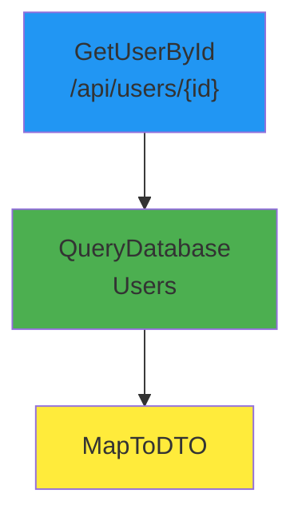

# Auto-Generate Diagrams

Workflow Tracker can automatically generate and publish focused diagrams to Confluence, or you can generate them manually for local comparison. This guide explains both approaches.

## 🎯 Three Ways to Generate Diagrams

### 1. **Manual CLI Tool** (for developers comparing local changes)
Use `create_diagrams.py` to manually generate diagrams from JSON scan results.

```powershell
python tools/create_diagrams.py output/workflow_graph.json `
  --module "Services/UserService" `
  --format mermaid `
  --output user_service
```

**When to use:**
- Comparing local workflow changes to existing documentation
- Creating custom diagrams for specific features
- Generating diagrams in different formats (Mermaid, Graphviz, PlantUML)

### 2. **Auto-Generate in CI/CD** (for automated Confluence publishing)
Use the `--auto-diagrams` flag during scan to automatically generate and embed diagrams in Confluence.

```bash
# CI/CD Pipeline
workflow-tracker scan --repo . --publish --auto-diagrams
```

**When to use:**
- TeamCity or Octopus Deploy automated deployments
- Automatic documentation updates on production releases
- Keeping Confluence pages synchronized with code

### 3. **GUI Button** (for local development)
Use the Streamlit GUI to interactively generate diagrams while exploring scan results.

```bash
workflow-tracker gui --repo .
```

**When to use:**
- Local development and debugging
- Interactive exploration of workflows
- Quick diagram generation without CLI commands

---

## 📋 Configuration for Auto-Diagrams

To enable auto-generation in CI/CD, configure which diagrams to create in `config/local.yaml`:

```yaml
confluence:
  url: "https://your-domain.atlassian.net"
  username: "your.email@company.com"
  api_token: "your-api-token"
  space_key: "~YOURUSERID"

  # Auto-diagram configuration
  auto_diagrams:
    # Which modules/directories to create diagrams for
    modules:
      - "Services/UserService"
      - "Services/OrderService"
      - "Controllers/UserController"

    # Which database tables to diagram
    tables:
      - "Users"
      - "Orders"
      - "Products"

    # Which API endpoints to diagram
    endpoints:
      - "/api/users"
      - "/api/orders"

    # Maximum nodes per diagram (keeps diagrams readable)
    max_nodes_per_diagram: 50
```

---

## 🚀 Using Auto-Diagrams in CI/CD

### TeamCity Example

```bash
#!/bin/bash
# teamcity-scan.sh

# Run scan with auto-diagram generation
docker run --rm \
  -v /path/to/repo:/repo \
  -v /path/to/config:/config \
  workflow-tracker:latest \
  scan --repo /repo \
       --config /config/local.yaml \
       --publish \
       --auto-diagrams

# Diagrams will be embedded in the Confluence page automatically
```

### Octopus Deploy Example

```powershell
# octopus-scan.ps1

# Run scan with auto-diagram generation
docker run --rm `
  -v ${PWD}:/repo `
  -v ${PWD}/config:/config `
  workflow-tracker:latest `
  scan --repo /repo `
       --config /config/local.yaml `
       --publish `
       --auto-diagrams
```

### What Gets Published

When `--auto-diagrams` is enabled:

1. **Confluence page includes:**
   - Summary statistics
   - Auto-generated Mermaid diagrams for configured modules/tables/endpoints
   - Sample workflow operations
   - JSON attachment with complete data

2. **Diagrams are:**
   - Embedded directly in the page as Mermaid code blocks
   - Color-coded by workflow type
   - Limited to max_nodes_per_diagram for readability
   - Collapsible for easy navigation

---

## 🖥️ Using the GUI for Diagram Generation

### Step-by-Step Guide

1. **Launch the GUI:**
   ```bash
   workflow-tracker gui --repo /path/to/repo
   ```

2. **Scan your repository:**
   - Configure scan options in the sidebar
   - Click "🔍 Scan Repository"
   - Wait for scan to complete

3. **Generate a diagram:**
   - In the sidebar, scroll to "📊 Generate Diagrams"
   - Choose filter type: Module/Directory, Database Table, or API Endpoint
   - Enter the filter value (e.g., "Services/UserService")
   - Adjust "Max Nodes" slider (10-100)
   - Click "🎨 Generate Diagram"

4. **View and download:**
   - The diagram appears at the top of the results
   - Copy the Mermaid code
   - Download as .mmd file
   - Paste into Mermaid Live Editor or Confluence

### GUI Features

- **Real-time filtering:** Generate multiple diagrams without re-scanning
- **Interactive sliders:** Adjust node limits on the fly
- **Download buttons:** Save diagrams locally
- **Visual feedback:** See node/edge counts immediately

---

## 📊 Diagram Output Examples

### Example 1: Module Diagram

**Configuration:**
```yaml
auto_diagrams:
  modules:
    - "Services/UserService"
```

**Result in Confluence:**


### Example 2: Database Table Diagram

**Configuration:**
```yaml
auto_diagrams:
  tables:
    - "Orders"
```

**Result:** Shows all operations (reads, writes, updates) on the Orders table.

### Example 3: API Endpoint Diagram

**Configuration:**
```yaml
auto_diagrams:
  endpoints:
    - "/api/orders"
```

**Result:** Shows the complete workflow for the `/api/orders` endpoint from API call through database operations to response.

---

## 🔄 Comparison: Manual vs Auto vs GUI

| Feature | Manual CLI | Auto (CI/CD) | GUI |
|---------|-----------|--------------|-----|
| **Use Case** | Custom diagrams, local comparison | Automated Confluence publishing | Interactive exploration |
| **Output Formats** | Mermaid, Graphviz, PlantUML | Mermaid only (embedded) | Mermaid only |
| **Confluence Publishing** | ❌ No (manual copy/paste) | ✅ Yes (automatic) | ❌ No (manual copy/paste) |
| **Configuration** | Command-line arguments | config.yaml settings | GUI form inputs |
| **Filtering** | Module, type, table, endpoint | Module, table, endpoint | Module, table, endpoint |
| **Best For** | Developers | CI/CD pipelines | Local development |

---

## 💡 Best Practices

### For Manual Diagrams
- Generate diagrams for specific features you're working on
- Use Graphviz for high-quality images in presentations
- Keep diagrams version-controlled with your code

### For Auto-Diagrams in CI/CD
- Start with 2-3 key modules, not everything
- Use meaningful module names in configuration
- Review generated diagrams in Confluence before sharing widely
- Adjust max_nodes_per_diagram if diagrams are too complex

### For GUI Development
- Generate diagrams while debugging to understand data flow
- Use the slider to find the right level of detail
- Download diagrams to share with team members
- Compare diagrams before/after code changes

---

## 🛠️ Troubleshooting

### No Diagrams Generated in Confluence

**Issue:** Ran with `--auto-diagrams` but no diagrams appear in Confluence.

**Solutions:**
1. Check configuration: Ensure `auto_diagrams` section exists in config.yaml
2. Verify module names: They must match actual directory paths in your repo
3. Check node counts: If no nodes match filter, no diagram is created
4. Review console output: Look for "Generating diagram for module..." messages

### Diagrams Too Complex

**Issue:** Generated diagrams have too many nodes to be readable.

**Solutions:**
1. Reduce `max_nodes_per_diagram` in config (try 25-30)
2. Use more specific module paths (e.g., "Services/UserService/Commands" instead of "Services")
3. Generate separate diagrams for read vs write operations
4. Filter by specific tables or endpoints instead of entire modules

### GUI Diagram Not Showing

**Issue:** Clicked "Generate Diagram" but nothing appears.

**Solutions:**
1. Check filter value: Ensure it matches actual module/table/endpoint names
2. Look for warning message in sidebar: "No nodes found matching..."
3. Try a broader filter (e.g., "Services" instead of "Services/UserService/Commands")
4. Verify scan completed successfully

### Mermaid Not Rendering in Confluence

**Issue:** Diagram code appears in Confluence but doesn't render.

**Solution:**
Install the "Mermaid Diagrams" app from Atlassian Marketplace:
1. Go to Confluence Admin → Find new apps
2. Search for "Mermaid Diagrams"
3. Install the app (usually free for small teams)
4. Refresh your page

---

## 📚 Related Documentation

- **[VISUALIZATION_GUIDE.md](VISUALIZATION_GUIDE.md)** - Complete guide to creating diagrams manually
- **[DIAGRAM_EXAMPLES.md](../examples/DIAGRAM_EXAMPLES.md)** - 10 real-world diagram examples
- **[CONFLUENCE_SETUP.md](CONFLUENCE_SETUP.md)** - Setting up Confluence integration
- **[config.example.yaml](../config/config.example.yaml)** - Full configuration reference

---

## 🎉 Quick Start

### For Developers (Manual)
```bash
# Scan repo
workflow-tracker scan --repo . --output ./output

# Generate diagram
python tools/create_diagrams.py output/workflow_graph.json \
  --module "Services/UserService" \
  --format mermaid
```

### For CI/CD (Auto)
```bash
# Update config/local.yaml with auto_diagrams settings
# Then run:
workflow-tracker scan --repo . --publish --auto-diagrams
```

### For Local GUI
```bash
workflow-tracker gui --repo .
# Then use the sidebar to generate diagrams
```

Choose the approach that fits your workflow! 🚀
