# UI Workflow Visualization Guide

## Overview

The Workflow Tracker now provides **UI-focused workflow analysis** that helps both technical and non-technical team members understand exactly what happens when users interact with your application.

## Who Is This For?

### 🎯 **For Product Managers**
- Understand how features work under the hood
- Document user flows for specifications
- Identify potential bottlenecks or inefficiencies
- Make data-driven decisions about features

### 👨‍💻 **For Developers**
- Trace execution paths from UI to database
- Identify data flow patterns
- Debug complex workflows
- Document system behavior

### 🧪 **For QA Teams**
- Identify all test scenarios for a feature
- Understand expected behavior at each step
- Find edge cases and error conditions
- Create comprehensive test plans

### 🎨 **For Designers**
- Understand system response to user actions
- See loading states and async operations
- Identify UX improvement opportunities
- Design better feedback mechanisms

### 📊 **For Business Analysts**
- Document business processes clearly
- Create system documentation
- Explain workflows to stakeholders
- Map requirements to implementation

## What You Get

### 1. UI Workflow Stories

Each workflow includes:

- **Trigger**: What user action starts this workflow (button click, form submit, etc.)
- **Steps**: Sequence of operations with plain language descriptions
- **Summary**: High-level overview of what the workflow does
- **Outcome**: What the user sees when it completes

**Example:**
```
# Save Customer Information

What happens: This workflow retrieves data from 1 database table(s),
then saves data to 2 database table(s).

User action: User clicks Save Customer Button

## Workflow Steps:

📖 Step 1: Retrieve data from Customers table
The system looks up existing information from the Customers table.
Technical: Database SELECT: Customers

💾 Step 2: Save data to Customers table
The system saves the information to the Customers table.
Technical: Database INSERT/UPDATE: Customers

🌐 Step 3: Call API Update Customer Service
The system communicates with an external service at /api/customers/update.
Technical: API POST: /api/customers/update

Result: The data is saved and the user sees a success confirmation.
```

### 2. Visual Flow Diagrams

Color-coded diagrams showing the complete flow:

- **Green nodes**: User actions and results
- **Blue nodes**: Database operations
- **Orange nodes**: API calls
- **Purple nodes**: Data processing/transformations

**Example Diagram:**

```mermaid
graph TD
    classDef userAction fill:#4CAF50,stroke:#45a049,stroke-width:3px,color:#fff
    classDef database fill:#2196F3,stroke:#1976D2,stroke-width:2px,color:#fff
    classDef api fill:#FF9800,stroke:#F57C00,stroke-width:2px,color:#fff
    classDef result fill:#4CAF50,stroke:#45a049,stroke-width:2px,color:#fff

    start["User clicks Save Customer Button"]:::userAction
    step1["📖 Retrieve data from Customers table"]:::database
    step2["💾 Save data to Customers table"]:::database
    step3["🌐 Call Update Customer Service"]:::api
    result["The data is saved and user sees confirmation"]:::result

    start --> step1
    step1 --> step2
    step2 --> step3
    step3 --> result
```


### 3. Technical Details

For developers, each step includes:
- Exact operation type (DATABASE_WRITE, API_CALL, etc.)
- Table names for database operations
- Endpoint URLs and HTTP methods for API calls
- File paths and line numbers
- Code snippets

## How to Use

### Step 1: Run a Scan

```bash
# Using the web UI
1. Navigate to http://localhost:3000/dashboard/scanner
2. Select your repository
3. Click "Start Scan"
4. Wait for completion (~10 seconds per 100 files)
```

### Step 2: View Workflows

Once the scan completes, you can access workflows via the API:

```bash
# Get all workflows
curl http://localhost:8000/api/v1/scanner/scan/{scan_id}/workflows

# Get specific workflow diagram
curl http://localhost:8000/api/v1/scanner/scan/{scan_id}/workflows/{workflow_id}/diagram
```

### Step 3: Share with Team

The workflow stories are perfect for:
- **Confluence pages**: Copy the markdown directly
- **GitHub/GitLab wikis**: Use as documentation
- **Presentations**: Export diagrams as images
- **Slack/Teams**: Share workflow summaries
- **JIRA tickets**: Document expected behavior

## API Endpoints

### GET `/api/v1/scanner/scan/{scan_id}/workflows`

Returns all UI workflows found in the scan.

**Response:**
```json
{
  "scan_id": "uuid",
  "total_workflows": 5,
  "workflows": [
    {
      "id": "workflow_abc123",
      "name": "Save Customer Button",
      "summary": "This workflow retrieves data from 1 table, saves to 2 tables",
      "outcome": "Data is saved and user sees confirmation",
      "trigger": {
        "name": "Save Customer Button",
        "description": "User clicks Save Customer Button",
        "interaction_type": "button_click",
        "component": "CustomerForm",
        "location": "/src/components/CustomerForm.tsx"
      },
      "steps": [
        {
          "step_number": 1,
          "title": "Retrieve data from Customers table",
          "description": "The system looks up existing information...",
          "technical_details": "Database SELECT: Customers",
          "icon": "📖"
        }
      ],
      "story": "# Save Customer Information\n\n..."
    }
  ]
}
```

### GET `/api/v1/scanner/scan/{scan_id}/workflows/{workflow_id}/diagram`

Returns diagram and story for a specific workflow.

**Response:**
```json
{
  "workflow_id": "workflow_abc123",
  "name": "Save Customer Button",
  "diagram": "graph TD\n    start[\"User clicks...\"]\n...",
  "story": "# Save Customer Information\n\n..."
}
```

## What Gets Detected

### UI Interactions
- Button clicks (`onClick`, `handleClick`, `onSave`)
- Form submissions (`onSubmit`, `handleSubmit`)
- Page loads (`onLoad`, `useEffect` with empty deps)
- Event handlers in C#, TypeScript, React, Angular, WPF

### Operations
- **Database**: Reads, writes, inserts, updates, deletes
- **API Calls**: REST endpoints, HTTP methods, external services
- **File I/O**: Reading/writing files
- **Message Queues**: Publishing/subscribing to topics
- **Data Transforms**: Mapping, filtering, aggregating data

### Data Flow Patterns
- API → Database (data ingestion)
- Database → Transform → API (data processing)
- Sequential operations within functions
- Proximity-based relationships

## Example Use Cases

### 1. Onboarding New Developers

**Before:**
"Here's the codebase, good luck finding how the save button works."

**After:**
"Here's a visual diagram showing exactly what happens when users click Save, including all database tables touched and APIs called."

### 2. QA Test Planning

**Before:**
Manual code review to identify all test scenarios.

**After:**
Automated workflow extraction showing all paths, operations, and edge cases.

### 3. Product Documentation

**Before:**
Technical docs written by developers, hard for non-technical folks to understand.

**After:**
Plain language workflow stories that anyone can understand, with technical details available for those who need them.

### 4. Bug Investigation

**Before:**
"The save button isn't working" → hours of debugging.

**After:**
View the workflow diagram to see exactly which step is failing and which database/API is involved.

### 5. Architecture Decisions

**Before:**
"How many database calls does this feature make?"

**After:**
See the complete workflow with all database operations clearly labeled.

## Best Practices

### For Product Managers
1. Review workflow stories during sprint planning
2. Share with stakeholders to explain features
3. Use diagrams in product specifications
4. Identify workflows that could be optimized

### For Developers
1. Run scans after major features are complete
2. Review workflows during code reviews
3. Use technical details to identify inefficiencies
4. Document complex workflows in wikis

### For QA Teams
1. Create test cases based on workflow steps
2. Test each step independently
3. Verify edge cases (database failures, API timeouts)
4. Use workflows to design integration tests

### For Designers
1. Understand loading states and delays
2. Design appropriate user feedback
3. Identify opportunities for progress indicators
4. Optimize flows based on operation counts

## Tips for Better Results

### 1. Use Descriptive Function Names
```typescript
// ✅ Good - will be detected as UI interaction
function handleSaveCustomer() { ... }

// ❌ Bad - might be missed
function func1() { ... }
```

### 2. Keep Related Code Together
The analyzer uses proximity to infer relationships. Keep related operations close in the code.

### 3. Comment Complex Workflows
Add comments explaining business logic - these can help trace workflows more accurately.

### 4. Use Consistent Patterns
Consistent code patterns make workflow detection more accurate.

## Troubleshooting

### "No workflows found"

**Possible causes:**
1. Code doesn't use common UI interaction patterns
2. File types not included in scan configuration
3. Functions aren't named with UI keywords

**Solutions:**
- Ensure `.ts`, `.tsx`, `.cs`, `.xaml` files are scanned
- Use keywords like `onClick`, `handleClick`, `onSubmit` in function names
- Check that UI components are in the scanned directories

### "Workflow seems incomplete"

**Possible causes:**
1. Operations are far apart in the code
2. Async operations not properly chained
3. Complex control flow (loops, conditions)

**Solutions:**
- Keep related code together (within 20 lines)
- Use clear function names
- Simplify complex flows where possible

### "Too many workflows"

**Possible causes:**
1. Many event handlers detected
2. Low threshold for UI interaction detection

**Solutions:**
- Filter workflows by name/component
- Focus on main user flows
- Adjust detection sensitivity (future feature)

## Future Enhancements

Planned features:
- [ ] User flow grouping (e.g., "Customer Management" flows)
- [ ] Performance metrics for each step
- [ ] Error handling paths
- [ ] Async operation visualization
- [ ] Integration with APM tools
- [ ] A/B test variant tracking
- [ ] Custom annotation support

## Support

For questions or issues:
1. Check the troubleshooting section above
2. Review example workflows in the repository
3. Open an issue on GitHub with scan results

## Summary

The UI Workflow Visualization feature transforms complex codebases into understandable, visual stories that help everyone on your team - from product managers to developers to QA - understand exactly what happens when users interact with your application.

**Key benefits:**
- 📊 Visual, easy-to-understand diagrams
- 📝 Plain language descriptions
- 🔍 Complete execution traces
- 🎯 Cross-functional team alignment
- ⚡ Automated documentation generation
