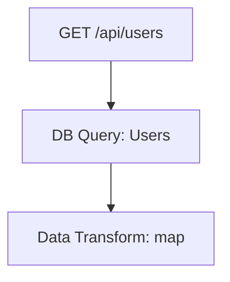
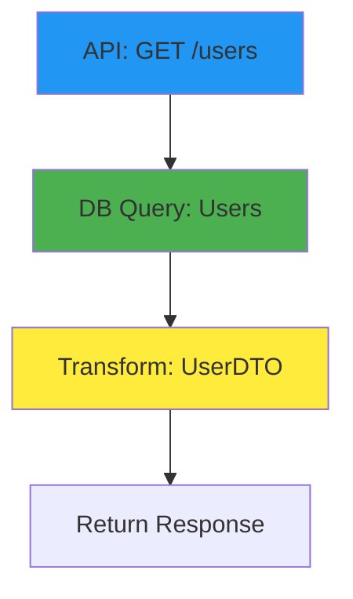

# Workflow Visualization Guide

This guide shows you how to create visual diagrams and flow charts from your scan results.

## 🎯 The Challenge

Your repository has **31,587 workflow nodes** - too many to visualize all at once! The solution is to create **focused diagrams** for specific workflows.

## 📊 Visualization Options

### Option 1: Focused Diagrams (Recommended)

Create targeted diagrams for specific modules, features, or workflows.

**Best for:**
- Documenting specific features
- Understanding data flow in a module
- Creating documentation for specific API endpoints

### Option 2: Summary Diagrams

Create high-level overviews showing system architecture.

**Best for:**
- Architecture documentation
- Identifying bottlenecks
- High-level system understanding

### Option 3: Interactive Exploration

Use the JSON data with analysis tools.

**Best for:**
- Ad-hoc queries
- Data analysis
- Custom tooling

---

## 🛠️ Tool 1: create_diagrams.py (Python Script)

I've created a tool that generates **Mermaid**, **Graphviz**, and **PlantUML** diagrams from your JSON data.

### Installation

```powershell
# The script is already in your repo
cd C:\Users\jparker\github\workflow-tracker

# Make sure you have Python installed (already have it from Docker)
python --version
```

### Basic Usage

```powershell
# Filter by module and create diagram
python tools/create_diagrams.py output/workflow_graph.json `
  --module "Services/User" `
  --format mermaid `
  --output user_service_diagram
```

### Examples

#### 1. Visualize a Specific Service

```powershell
# Show all workflows in UserService
python tools/create_diagrams.py output/workflow_graph.json `
  --module "Services/UserService" `
  --format all `
  --output diagrams/user_service

# Creates:
#   diagrams/user_service.mmd (Mermaid)
#   diagrams/user_service.dot (Graphviz)
#   diagrams/user_service.puml (PlantUML)
```

#### 2. Show All API Calls

```powershell
# Filter to only API calls
python tools/create_diagrams.py output/workflow_graph.json `
  --type api_call `
  --format mermaid `
  --output diagrams/api_calls
```

#### 3. Database Operations for a Table

```powershell
# Show all operations on Users table
python tools/create_diagrams.py output/workflow_graph.json `
  --table Users `
  --format dot `
  --output diagrams/users_table

# Render as image
dot -Tpng diagrams/users_table.dot -o diagrams/users_table.png
```

#### 4. Workflows for an API Endpoint

```powershell
# Show workflows for /api/users endpoint
python tools/create_diagrams.py output/workflow_graph.json `
  --endpoint "/api/users" `
  --format mermaid `
  --output diagrams/users_api
```

---

## 🎨 Visualization Formats

### Format 1: Mermaid (Recommended)

**Advantages:**
- ✅ Works in Markdown (GitHub, GitLab, Confluence)
- ✅ Interactive online editor
- ✅ No installation needed
- ✅ Easy to share

**How to use:**

1. Generate diagram:
```powershell
python tools/create_diagrams.py output/workflow_graph.json `
  --module "Controllers" `
  --format mermaid
```

2. Open `diagram.mmd` in text editor

3. **Option A** - Paste into https://mermaid.live/
   - Interactive editor
   - Export as PNG/SVG
   - Share URL

4. **Option B** - Add to Markdown:
```markdown
# User Service Workflow

This diagram shows the data flow in the User Service.


```

5. **Option C** - Add to Confluence:
   - Install "Mermaid Diagrams" macro
   - Paste Mermaid code

**Example Output:**


### Format 2: Graphviz DOT

**Advantages:**
- ✅ High-quality images
- ✅ Powerful layout algorithms
- ✅ Scriptable

**How to use:**

1. Install Graphviz:
```powershell
# Windows - using Chocolatey
choco install graphviz

# Or download from: https://graphviz.org/download/
```

2. Generate diagram:
```powershell
python tools/create_diagrams.py output/workflow_graph.json `
  --module "Services" `
  --format dot `
  --output my_diagram
```

3. Render to image:
```powershell
# PNG
dot -Tpng my_diagram.dot -o my_diagram.png

# SVG (scalable)
dot -Tsvg my_diagram.dot -o my_diagram.svg

# PDF
dot -Tpdf my_diagram.dot -o my_diagram.pdf
```

4. Different layouts:
```powershell
# Top-to-bottom (default)
dot -Tpng my_diagram.dot -o output.png

# Left-to-right
dot -Grankdir=LR -Tpng my_diagram.dot -o output.png

# Circular
circo -Tpng my_diagram.dot -o output.png

# Force-directed
neato -Tpng my_diagram.dot -o output.png
```

### Format 3: PlantUML

**Advantages:**
- ✅ Sequence diagrams
- ✅ Great for showing interactions
- ✅ Clean, professional look

**How to use:**

1. Generate diagram:
```powershell
python tools/create_diagrams.py output/workflow_graph.json `
  --module "Controllers/UserController" `
  --format plantuml
```

2. **Option A** - Online editor:
   - Go to http://www.plantuml.com/plantuml/
   - Paste content of `.puml` file
   - Download PNG/SVG

3. **Option B** - Local rendering:
```powershell
# Install PlantUML
choco install plantuml

# Or download from: https://plantuml.com/download

# Render
plantuml diagram.puml
# Creates diagram.png
```

---

## 📝 Common Diagram Scenarios

### Scenario 1: Document a Feature

**Goal:** Show how "User Registration" works

```powershell
# 1. Filter to registration-related code
python tools/create_diagrams.py output/workflow_graph.json `
  --module "Services/Registration" `
  --format mermaid `
  --output docs/registration_workflow

# 2. Add to your documentation
# Copy registration_workflow.mmd content to your README or wiki
```

### Scenario 2: Database Access Patterns

**Goal:** Show all code that touches the Users table

```powershell
python tools/create_diagrams.py output/workflow_graph.json `
  --table Users `
  --format dot `
  --output docs/users_table_access

dot -Tpng docs/users_table_access.dot -o docs/users_table_access.png
```

### Scenario 3: API Endpoint Documentation

**Goal:** Document what happens when `/api/orders` is called

```powershell
python tools/create_diagrams.py output/workflow_graph.json `
  --endpoint "/api/orders" `
  --format mermaid `
  --output docs/orders_api_flow
```

### Scenario 4: Module Dependencies

**Goal:** Show how OrderService interacts with other services

```powershell
python tools/create_diagrams.py output/workflow_graph.json `
  --module "Services/OrderService" `
  --format plantuml `
  --output docs/order_service_deps
```

---

## 🔄 Creating Multiple Diagrams (Batch Processing)

Create diagrams for all your main modules:

```powershell
# PowerShell script
$modules = @(
    "Services/UserService",
    "Services/OrderService",
    "Services/PaymentService",
    "Controllers/UserController",
    "Controllers/OrderController"
)

foreach ($module in $modules) {
    $name = $module.Replace("/", "_")
    Write-Host "Creating diagram for $module..."

    python tools/create_diagrams.py output/workflow_graph.json `
        --module $module `
        --format mermaid `
        --output "diagrams/$name"
}

Write-Host "✓ Created diagrams for all modules!"
```

---

## 📊 Analysis Tools

### Tool: List All Tables

```powershell
# PowerShell - Extract all database tables
$json = Get-Content output/workflow_graph.json | ConvertFrom-Json
$tables = $json.nodes | Where-Object { $_.table_name } |
    Select-Object -ExpandProperty table_name -Unique | Sort-Object

$tables | ForEach-Object {
    Write-Host "Table: $_"
}
```

### Tool: List All API Endpoints

```powershell
# PowerShell - Extract all API endpoints
$json = Get-Content output/workflow_graph.json | ConvertFrom-Json
$endpoints = $json.nodes | Where-Object { $_.endpoint } |
    Select-Object -ExpandProperty endpoint -Unique | Sort-Object

$endpoints | ForEach-Object {
    Write-Host "Endpoint: $_"
}
```

### Tool: Count Operations by Module

```powershell
# PowerShell - Count operations by directory
$json = Get-Content output/workflow_graph.json | ConvertFrom-Json
$json.nodes | Group-Object {
    Split-Path (Split-Path $_.location.file) -Leaf
} | Select-Object Count, Name | Sort-Object Count -Descending |
    Format-Table -AutoSize
```

---

## 🎯 Best Practices

### 1. Start Small

Don't try to visualize everything at once:

```powershell
# ❌ BAD - Too many nodes
python tools/create_diagrams.py output/workflow_graph.json

# ✅ GOOD - Focused on one module
python tools/create_diagrams.py output/workflow_graph.json `
  --module "Services/UserService"
```

### 2. Use Multiple Filters

Combine filters for very focused diagrams:

```powershell
# Show only API calls in UserService
python tools/create_diagrams.py output/workflow_graph.json `
  --module "Services/UserService" `
  --type api_call
```

### 3. Choose the Right Format

- **Mermaid**: For documentation (Markdown, Confluence)
- **Graphviz**: For high-quality images
- **PlantUML**: For sequence diagrams

### 4. Organize Your Diagrams

```
docs/
├── architecture/
│   ├── user_service.png
│   ├── order_service.png
│   └── payment_service.png
├── api/
│   ├── users_endpoint.mmd
│   └── orders_endpoint.mmd
└── database/
    ├── users_table.dot
    └── orders_table.dot
```

### 5. Keep Diagrams Updated

Add to your CI/CD pipeline:

```powershell
# Generate diagrams automatically on deploy
workflow-tracker scan --repo . --publish

python tools/create_diagrams.py output/workflow_graph.json `
  --module "Services" `
  --format mermaid `
  --output docs/services_workflow

# Commit to repo
git add docs/services_workflow.mmd
git commit -m "Update workflow diagrams"
```

---

## 🚀 Advanced: Custom Visualizations

### Use Python for Custom Analysis

```python
import json
import matplotlib.pyplot as plt
import networkx as nx

# Load data
with open('output/workflow_graph.json') as f:
    data = json.load(f)

# Filter to specific module
module_nodes = [n for n in data['nodes'] if 'UserService' in n['location']['file']]
node_ids = {n['id'] for n in module_nodes}
module_edges = [e for e in data['edges'] if e['source'] in node_ids and e['target'] in node_ids]

# Create graph
G = nx.DiGraph()
for node in module_nodes:
    G.add_node(node['id'], **node)
for edge in module_edges:
    G.add_edge(edge['source'], edge['target'])

# Visualize
pos = nx.spring_layout(G)
nx.draw(G, pos, with_labels=True, node_color='lightblue', node_size=500)
plt.savefig('custom_diagram.png', dpi=300, bbox_inches='tight')
```

### Use draw.io (diagrams.net)

1. Export nodes to CSV:
```powershell
# PowerShell
$json = Get-Content output/workflow_graph.json | ConvertFrom-Json
$json.nodes | Select-Object name, type, @{N='file';E={$_.location.file}} |
    Export-Csv -Path nodes.csv -NoTypeInformation
```

2. Import into draw.io:
   - File → Import → CSV
   - Choose layout
   - Customize appearance

---

## 📚 Quick Reference

| Use Case | Command | Output |
|----------|---------|--------|
| Single module | `--module "Services/User"` | Workflows in that module |
| Database table | `--table Users` | All code touching Users table |
| API endpoint | `--endpoint "/api/users"` | All code for that endpoint |
| Workflow type | `--type api_call` | Only API calls |
| For Markdown | `--format mermaid` | GitHub/GitLab compatible |
| High-quality image | `--format dot` | PNG/SVG output |
| Sequence diagram | `--format plantuml` | Call sequences |

---

## 💡 Tips

1. **Start with Mermaid** - Easiest to get started with
2. **Use online editors** - No installation needed
3. **Filter aggressively** - 50-100 nodes per diagram maximum
4. **Document as you go** - Create diagrams for each feature
5. **Version control your diagrams** - Keep them with your code

---

## 🆘 Getting Help

Can't find what you're looking for?

```powershell
# See all available filters
python tools/create_diagrams.py --help

# List all tables in your repo
# (see Analysis Tools section above)

# List all modules
# (see Analysis Tools section above)
```

---

## Example: Complete Workflow

```powershell
# 1. Run the scan (you've already done this)
docker-compose up workflow-tracker

# 2. Create diagram for specific module
python tools/create_diagrams.py output/workflow_graph.json `
  --module "Services/UserService" `
  --format mermaid `
  --output user_service

# 3. View in browser
# Open https://mermaid.live/
# Paste content from user_service.mmd

# 4. Export as PNG for documentation

# 5. Add to Confluence
# Copy diagram to your Confluence page
```

Now you have beautiful, focused workflow diagrams! 🎉
