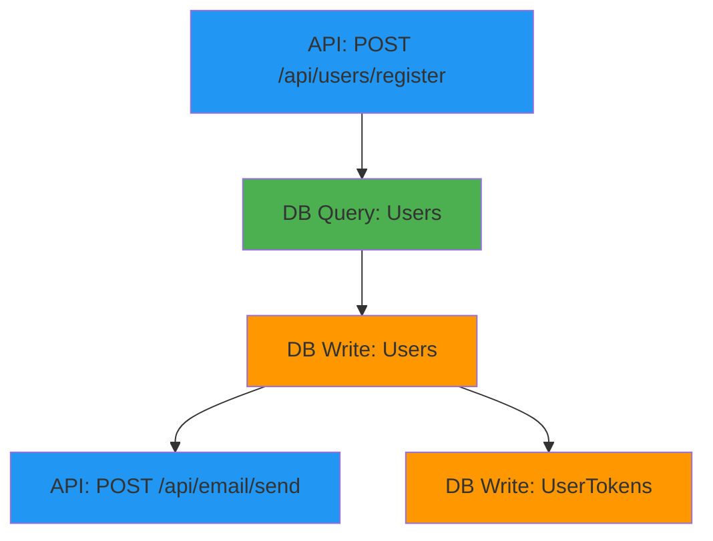
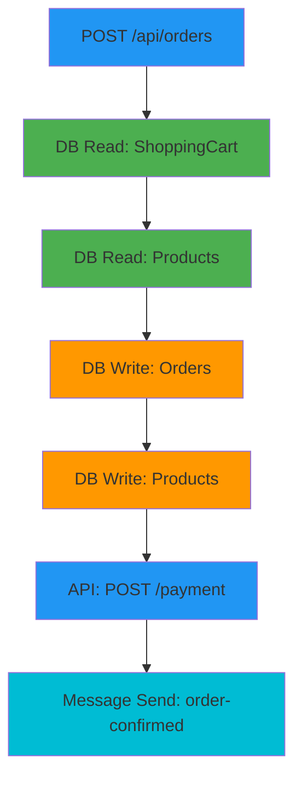
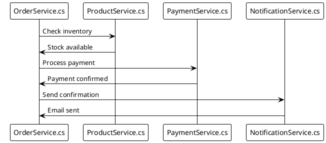
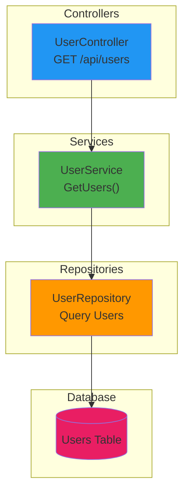

# Workflow Diagram Examples

This document shows real examples of the diagrams you can create.

## Example 1: User Registration Workflow

### Command:
```powershell
python tools/create_diagrams.py output/workflow_graph.json `
  --module "Services/UserService" `
  --format mermaid `
  --output user_registration
```

### Result (user_registration.mmd):


### What it shows:
1. API endpoint receives registration request
2. Checks if user already exists (DB Query)
3. Creates new user (DB Write)
4. Sends welcome email (API Call)
5. Creates authentication token (DB Write)

---

## Example 2: Order Processing Workflow

### Command:
```powershell
python tools/create_diagrams.py output/workflow_graph.json `
  --endpoint "/api/orders" `
  --format mermaid `
  --output order_processing
```

### Result:


### What it shows:
Complete order processing flow from API call to payment and confirmation.

---

## Example 3: Database Access Pattern

### Command:
```powershell
python tools/create_diagrams.py output/workflow_graph.json `
  --table Users `
  --format dot `
  --output users_table_access

dot -Tpng users_table_access.dot -o users_table_access.png
```

### What it shows:
All code paths that read from or write to the Users table, helping you:
- Identify all entry points to user data
- Find potential security issues
- Document data access patterns
- Plan database optimization

---

## Example 4: Service Dependencies

### Command:
```powershell
python tools/create_diagrams.py output/workflow_graph.json `
  --module "Services/OrderService" `
  --format plantuml `
  --output order_service_deps
```

### Result (order_service_deps.puml):


### What it shows:
How OrderService interacts with other services, showing the sequence of calls.

---

## Example 5: API Endpoint Summary

### Use Case:
Create a reference showing all API endpoints in your application.

### Command:
```powershell
# Extract all API endpoints
$json = Get-Content output/workflow_graph.json | ConvertFrom-Json
$endpoints = $json.nodes | Where-Object { $_.endpoint } | Group-Object endpoint

# Create summary document
"# API Endpoints`n" | Out-File api_summary.md

foreach ($group in $endpoints | Sort-Object Name) {
    "## $($group.Name)`n" | Out-File api_summary.md -Append
    "Operations: $($group.Count)`n" | Out-File api_summary.md -Append

    # Get associated files
    $files = $group.Group | ForEach-Object { $_.location.file } | Select-Object -Unique
    "Files:`n" | Out-File api_summary.md -Append
    $files | ForEach-Object { "- $_`n" } | Out-File api_summary.md -Append

    # Create diagram
    $safeName = $group.Name -replace '[/:]', '_'
    python tools/create_diagrams.py output/workflow_graph.json `
        --endpoint $group.Name `
        --format mermaid `
        --output "api_docs/endpoint$safeName"

    "`nDiagram: [View](./ endpoint$safeName.mmd)`n`n---`n" | Out-File api_summary.md -Append
}
```

### Result:
Complete API documentation with workflow diagrams for each endpoint.

---

## Example 6: Data Flow Through Layers

### Use Case:
Show how data flows from Controller → Service → Repository → Database

### Command:
```powershell
# Create diagram showing layered architecture
python tools/create_diagrams.py output/workflow_graph.json `
  --endpoint "/api/users" `
  --format mermaid `
  --output layered_architecture
```

### Result:


---

## Example 7: Feature Documentation

### Use Case:
Document a complete feature for onboarding new developers.

### Workflow:
```powershell
# 1. Create feature branch documentation folder
New-Item -ItemType Directory -Path "docs/features/user_authentication"

# 2. Generate workflow diagrams
python tools/create_diagrams.py output/workflow_graph.json `
  --module "Services/AuthenticationService" `
  --format all `
  --output "docs/features/user_authentication/auth_workflow"

# 3. Create endpoint-specific diagrams
python tools/create_diagrams.py output/workflow_graph.json `
  --endpoint "/api/auth/login" `
  --format mermaid `
  --output "docs/features/user_authentication/login_flow"

python tools/create_diagrams.py output/workflow_graph.json `
  --endpoint "/api/auth/register" `
  --format mermaid `
  --output "docs/features/user_authentication/register_flow"

# 4. Create README with embedded diagrams
@"
# User Authentication Feature

## Overview
This feature handles user registration, login, and authentication.

## Login Flow

``````mermaid
$(Get-Content "docs/features/user_authentication/login_flow.mmd")
``````

## Registration Flow

``````mermaid
$(Get-Content "docs/features/user_authentication/register_flow.mmd")
``````

## Implementation Files
- Controllers/AuthenticationController.cs
- Services/AuthenticationService.cs
- Repositories/UserRepository.cs

## Database Tables
- Users
- UserTokens
- RefreshTokens
"@ | Out-File "docs/features/user_authentication/README.md"
```

---

## Example 8: Performance Optimization

### Use Case:
Identify database query hotspots.

### Command:
```powershell
# Find all database reads
python tools/create_diagrams.py output/workflow_graph.json `
  --type database_read `
  --format mermaid `
  --output db_reads

# Count queries by table
$json = Get-Content output/workflow_graph.json | ConvertFrom-Json
$dbReads = $json.nodes | Where-Object { $_.type -eq 'database_read' }

$queryCount = $dbReads | Group-Object table_name | Sort-Object Count -Descending

Write-Host "Database Query Hotspots:"
$queryCount | Format-Table Name, Count -AutoSize
```

### Result:
```
Database Query Hotspots:

Name           Count
----           -----
Users           234
Orders          189
Products        156
ShoppingCart     89
```

This helps you identify which tables are queried most frequently and may need caching or optimization.

---

## Example 9: Security Audit

### Use Case:
Find all code that accesses sensitive user data.

### Command:
```powershell
# Find all operations on Users table
python tools/create_diagrams.py output/workflow_graph.json `
  --table Users `
  --format mermaid `
  --output security_audit_users

# Extract file locations
$json = Get-Content output/workflow_graph.json | ConvertFrom-Json
$userAccess = $json.nodes | Where-Object { $_.table_name -eq 'Users' }

Write-Host "Files accessing Users table:"
$userAccess | Select-Object -ExpandProperty location |
    Select-Object -ExpandProperty file -Unique | Sort-Object
```

### What it helps with:
- Audit all code paths that access user data
- Verify authentication is required
- Identify potential security vulnerabilities
- Document data access for compliance

---

## Example 10: Onboarding Documentation

### Use Case:
Create a visual codebase tour for new developers.

### Script:
```powershell
# Create onboarding documentation
$onboardingDir = "docs/onboarding"
New-Item -ItemType Directory -Path $onboardingDir -Force

# 1. System overview
python tools/create_diagrams.py output/workflow_graph.json `
  --format mermaid `
  --output "$onboardingDir/01_system_overview"

# 2. Main services
@("UserService", "OrderService", "PaymentService", "NotificationService") | ForEach-Object {
    python tools/create_diagrams.py output/workflow_graph.json `
        --module "Services/$_" `
        --format mermaid `
        --output "$onboardingDir/02_$_"
}

# 3. API endpoints
python tools/create_diagrams.py output/workflow_graph.json `
  --type api_call `
  --format mermaid `
  --output "$onboardingDir/03_api_endpoints"

# 4. Database schema usage
@("Users", "Orders", "Products") | ForEach-Object {
    python tools/create_diagrams.py output/workflow_graph.json `
        --table $_ `
        --format mermaid `
        --output "$onboardingDir/04_table_$_"
}

Write-Host "✓ Created onboarding documentation in $onboardingDir"
Write-Host "Share this folder with new team members!"
```

---

## Tips for Creating Effective Diagrams

### 1. Keep It Focused
- ✅ One feature or module per diagram
- ❌ Don't try to show everything

### 2. Use Descriptive Names
```powershell
# ✅ GOOD - Descriptive
--output "user_registration_complete_flow"

# ❌ BAD - Generic
--output "diagram1"
```

### 3. Add Context in Documentation
Don't just share the diagram - explain what it shows:
```markdown
## User Registration Flow

This diagram shows the complete user registration process:

1. API receives registration request
2. System checks if email already exists
3. New user record is created
4. Welcome email is sent
5. Authentication token is generated

[Mermaid diagram here]

### Key Points
- Email validation happens before database write
- Email sending is asynchronous
- Tokens expire after 24 hours
```

### 4. Update Regularly
Add diagram generation to your CI/CD:
```powershell
# In deployment script
workflow-tracker scan --repo . --publish
python tools/create_diagrams.py output/workflow_graph.json `
  --module "Services" `
  --format mermaid `
  --output docs/current_workflows
git add docs/current_workflows.mmd
git commit -m "Update workflow diagrams"
```

---

## Next Steps

1. **Run your scan** (if not done already):
   ```powershell
   docker-compose up workflow-tracker
   ```

2. **Try the interactive tool**:
   ```powershell
   .\tools\quick_diagrams.ps1
   ```

3. **Create your first diagram**:
   ```powershell
   python tools/create_diagrams.py output/workflow_graph.json `
     --module "Services" `
     --format mermaid
   ```

4. **View in browser**:
   - Open https://mermaid.live/
   - Paste diagram content
   - Export as PNG

5. **Add to documentation**:
   - Copy to your README
   - Upload to Confluence
   - Share with your team

Happy diagramming! 🎨
